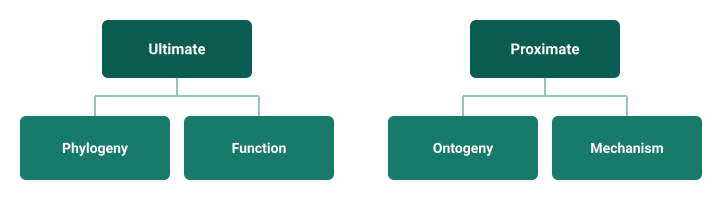
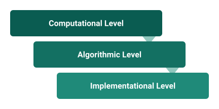

Studying psychology can feel a bit disorienting. Many undergraduate courses and research topics in psychology appear to be only loosely connected. The psychological literature is filled with myriad empirical findings, many of which are not even be reliably repeatable (Anvari & Lakens, 2018). Professors and researchers defend "theories" that feel more like confidently stated hunches about psychological phenomena than well-developed explanations and descriptions (Eronen & Bringmann, 2021).

Students are often left to try to make sense of this mishmash without an overarching theoretical framework to guide us in interpreting and parsing the information we are given. It's like trying to put together a puzzle without knowing what it should look like at the end. In this chapter, we'll discover theoretical frameworks that can provide us some hints at how we might go about putting the puzzle together --- or at least figure out what jigsaw pieces we are looking for.

## Navigating Questions and Explanations

To make progress in science, we need to be able to ask good research questions and develop good explanations of the phenomena we are interested in. But there are many ways we could ask questions and develop explanations. At a very broad level, we can ask *why a thing exists* and we can ask *how a thing works*. For example, if we want to develop a scientific understanding of vision, we can ask why eyes exist and we can ask how eyes work with our mind-brain to produce the experience of sight. The first question is often called an *ultimate* question. The second question is an example of a *proximate* question. Within each of these broad questions, we can also ask many more specific questions: How does the lens refract light into the retina? How is light converted into electrical signals that can be interpreted by our occipital lobes? What does vision accomplish? And so on.

Although we'll see that these types of questions provide somewhat different pieces of an explanation we want to assemble, they are often mistaken by students (and researchers) as *competing* explanations. This can lead to confusion---and even hostility---when people conflate discussion of one particular question or explanation with claiming that others are unimportant or irrelevant. But these questions and explanations are actually *complimentary*. Rather than one type of question or explanation diminishing the importance of another, all types of explanations are necessary to fully understand the phenomenon. We might have our favorite type, but that doesn't mean others are unimportant.

This ultimate versus proximate distinction can be broken down further to include questions (and explanations) about *phylogeny*, *function*, *ontogeny*, and *mechanism*, which are often referred to as **Tinbergen's Four Questions** after Nicolaas Tinbergen, a prominent biologist who wrote about them in the 1960s. I'll explain each of these in more detail in the sections to follow. Other useful resources for learning about these four questions include Tinbergen's original paper (Tinbergen, 1963) and various more-recent review papers (e.g., Bateson & Laland, 2013; Nesse, 2019). For now, be forewarned that none of these questions are easy to answer and all are necessary to develop a complete understanding of a phenomenon.

{#fig-tinbergen fig-alt="Two hierarchies side by side. Ultimate divides into Phylogeny and Function; Proximate divides into Ontogeny and Mechanism." width="620"}

### Ultimate versus Proximate and Tinbergen's Four

**Ultimate** questions (or explanations) ask (or explain) why a thing, like a personality trait, exists at all. These questions are typically concerned with the emergence and purpose of a trait in a population of organisms (e.g., a species, taxa, or kingdom) over deep evolutionary time (i.e., hundreds of thousands or millions of years). Ultimate questions are further broken down into Phylogeny and Function within Tinbergen's framework.

> **Phylogeny** is a fancy word referring to the evolutionary history of a trait. Research on the phylogeny of a trait aims to explain its evolution over deep time from the non-existence of a trait to its current form. Examples of questions about phylogeny include: When did the trait first evolve? Did it evolve independently in different species or do many species have the trait because they share a common ancestor with the trait? Questions about phylogeny are notoriously difficult to answer because they rely on careful comparisons of related species, fossil evidence, and genetics.
>
> **Function** refers to the evolutionary purpose of a trait. In general, traits become common in a species because they do something to help individuals survive and reproduce (or are intertwined with traits that do). Traits that directly aid in solving the problems of survival and reproduction that organisms face are called adaptations. To make progress on understanding many traits we might be interested in, we can take a gamble and assume that it exists because it somehow solved a problem related to survival and reproduction through evolutionary time.
>
> By trying to identify potential evolutionary functions of a trait, we can develop better questions to potentially learn undiscovered things about the trait and, eventually, to develop explanations for why a given trait works or looks the way it does. Some examples of questions about function include: what problem did this trait help our ancestors solve? How does the design of the trait (e.g., the chemical makeup of stomach acid) help to solve the problem (e.g., digesting food)?
>
> Functional explanations can be difficult to generate because the function of a trait may not be obvious, and in our modern world some traits may not even function the way they are supposed to---this is a phenomenon called *evolutionary mismatch,* which we will explore in a later chapter. Moreover, sometimes it is too easy to come up with satisfying explanations for the evolved functions of traits without really scrutinizing them scientifically; this is called "just-so" storytelling. We must be vigilant to make sure that the functional explanations that we accept have generated novel predictions and supporting evidence through scientific inquiry. (we'll talk about all this more in a later chapter on evolutionary approaches to human behavior.)

**Proximate** questions are generally more concerned with identifying how traits work and develop within an individual's lifespan (or on even shorter timescales). The two types of questions within the proximate level of analysis are questions about *ontogeny* and *mechanism*.

> **Ontogeny** is another fancy word that simply refers to development. Questions and explanations about ontogeny are concerned with the development of a given trait from conception onwards. Ontogeny-focused questions don't have to focus on the full lifespan, however. Some example questions include: how does the trait change during puberty? How does early life experiences relate to the development of the trait? How does an individual's genetic code interact with the environment to produce the trait? At what age does the trait emerge or disappear?
>
> **Mechanism** refers to how a trait works. Mechanistic explanations depend on identifying and describing the physical processes within the body that contribute to the development of the trait. If we can think of organisms as organic robots, then mechanistic questions are designed to assess how the gears, wires, sensors, and software of the robot interact to build the robot and produce its behavior. Some mechanism questions include: How do hormones interact to produce a behavior? What organs are involved in the producing a behavior? What are the activating rules, or inputs, that trigger the production of the behavior?

Importantly, none of the explanations that we might derive from the four types of questions can provide a complete understanding of a trait by themselves. To fully understand any trait that we might be interested in, it will be necessary to compile explanations from both the proximate and ultimate level of analysis. By organizing research questions and explanations according to this framework we can avoid some common pitfalls that slow our understanding and scientific progress.

### Levels of Analysis

To understand personality, we must first understand how the mind-brain works. This is no easy task---humans have been trying to figure this out for hundreds of years! Since the 1950s, thinking of the brain as an information processor has been the guiding principle of cognitive science and has proven quite useful (Miller, 2003). According to this view, the mind-brain can be viewed as an information processing system, just like the computer I'm writing this on. But even simple information processing systems can be pretty difficult to understand. Most of us, including myself, don't even know how our laptop's word processor works in much detail... and the mind is much more complex!

So how can we best go about organizing our research questions and explanations to figure out how the mind works in an information processing sense? Lucky for us, the neuroscientist David Marr proposed just such a framework for making sense of complex information processing systems at multiple levels of analysis in the late 1970s.

Marr proposed three levels of analysis: the *computational level*, the *algorithmic level*, and the *implementational level* (c.f., Bechtel & Shagrir, 2015). The three levels are hierarchical, which means that (in general) we must start with the first level and move down to more detailed levels one at a time, especially when it comes to psychological phenomena. If we could develop a good understanding of the mind at each of these three levels, we may be able to more easily figure out where individual differences in thoughts, feelings, and behavior arise.

{#fig-marr fig-alt="Three descending stepped bars: Computational Level, then Algorithmic Level, then Implementational Level." width="470"}

At the **computational level**, we define the problem that a given system is supposed to solve, and ideally why it needs to solve that problem. This is very similar to the functional level of analysis within Tinbergen's questions: What is the purpose of the thing? Why did it evolve?

Let's try to define the computational level for a word-processor program. We might say that its purpose is to allow us to get our thoughts out of our heads and onto virtual paper in a way that is easily editable and nicely formatted. We might also include that it should detect spelling errors because we want to share our thoughts with others in a way that can be easily understood.

Now let's look at a more psychological example. The emotion we call "anger" could be defined at the computational level as a psychological software program, much like a word processor or other computer program. We could say that this anger software's function is to bargain for better treatment from others because the way others treat us influences our survival and reproduction (Sell et al., 2009). We'll explore this computational analysis of anger more when we learn about emotions and personality.

At the **Algorithmic level**, we define the steps that the information processing system would need to carry out to solve the problem defined at the computational level. An *algorithm* is a series of steps or rules. The complexity of the algorithm required will depend heavily on the problem that needs to be solved. Moreover, there are likely many potential algorithms that could successfully accomplish the goal and representations (e.g., symbols, concepts) that can be used in the computation.

Let's go back to our word processor example. Perhaps we could provide an algorithmic description for the automatic spell-checker as follows:

> \(1\) the user typed a word (e.g., "algorithmic") into the virtual paper and the computer compares that word to a massive dictionary containing words in the language the user has previously specified
>
> \(2\) if an exact match in the dictionary is found, then nothing happens; but if no exact matches are found, the program puts an ugly red line under the word on the screen, looks for words that are very close in spelling to that word, and provides these suggestions to the user.

This is likely an oversimplification of the how spell-check works but it should give you an idea of how we might begin to lay out the steps and rules to define the spell-checker at the algorithmic level. The algorithm is the series of steps and rules, and the representations are the words in the English dictionary (or other dictionary for people writing in other languages).

How about for something more psychological? We can attempt an algorithmic definition for the emotion of anger as follows:

> \(1\) after an interaction with a person, your brain estimates the value that they place on your wellbeing compared to how much you think they should value your wellbeing;
>
> \(2\) if your brain estimates a large discrepancy between their valuation of you and what you think their valuation should be, anger is activated;
>
> \(3\) anger produces thoughts, feelings, and behaviors that may be successful in changing how much the person values you in the future (e.g., you make a face so they know you are angry, you threaten to not hang out with them anymore).

Of course, this is an oversimplification of the algorithm(s) underpinning anger. But even this relatively simple algorithmic analysis can allow us to develop more fine-grained descriptions of anger and develop clear predictions (does anger activate when we feel undervalued?). Ultimately, this should help us better understand the emotion and how it works. In this example, the representations used by the algorithm are fairly abstract (VALUE; WELLBEING), and the steps are fairly simple. But we could attempt to make the representations and algorithmic steps more concrete by, for example, using mathematical functions or computer code to model define them. And we can develop more concrete algorithmic descriptions about how the mind might compute value and wellbeing.

At the **implementational level**, we define how the algorithms that solve the problem are set up in the physical world. If the algorithmic level is the software of a program, the implementational level refers to the hardware the program runs on. At this level, we want to point to physical things in the world (e.g., neurons, computer chips, gears, and cogs) that actually carry out the algorithmic computations in our physical reality. This is a very challenging level of analysis to get right because many complex information processing systems, like the mind, are hierarchically organized. So, different processing systems may be implemented in the same physical space, but they depend on different patterns of interactions of many physical elements.

Let's go back again to our word-processor example. To give an implementational level description we probably have to point to the hardware of the computer. This will likely include many elements. For example, we would need to incorporate the keyboard we use to (mis)type the words in our heads; and the computer chips that convert electrical information sent from the keyboard into symbols on the screen; and the pixels on the screen that display the symbols; and mouse that allows us to right-click the ugly red squiggly line to get the correct spelling for the word we misspelled. And probably much more. I won't pretend to know how all the details are truly implemented on the physical parts of my computer.

And we would hope to be able to do the same for our psychology. If we want to give a description of any psychological program, like anger, at the implementational level, we'd have to point to our brains. But saying that "it's implemented in the brain" is probably too vague to be a useful description of anger because everything about human psychology is ultimately instantiated in the brain!

Ideally, we could point to some more specific part of the brain (e.g., the amygdala or frontal lobe). And eventually maybe to more specific clusters or neurons or interactions among groups of neurons. We might also need to describe how other areas of the body are involved in anger. For example, the muscles and tendons that contort our faces in a way that says, "I'm angry!" without us saying a word. In general, I think we are long way off from understanding the implementational level of many psychological phenomena (like emotions or personality)---especially because we don't yet have a great grasp of things at the algorithmic or even the computational levels of analysis. But maybe you can help change that!

## Connecting to Personality

At this point, you may be wondering what any of this has to do with personality. It might not be clear how applying Tinbergen's Four Questions or moving through Marr's three levels of analysis helps us understand a personality trait. To better appreciate how these frameworks can help us study personality, let's practice applying them to personality.

Pick a personality trait to think about for this exercise. I'm going to go with *pessimism* because I'm a bit pessimistic and I like alliteration, so the P in pessimism gives me some alliteration with my first name and it also describes me: *Pessimistic Patrick.* You should think about a different trait here---maybe one that describes your own personality and makes some nice alliteration with your first name.

How might we apply Tinbergen's Four Questions to \[pessimism / your trait\]? Let's start with the ultimate questions concerning function and phylogeny.

For **function**, we want to ask questions and seek answers that allow us to understand why the trait evolved. We could also ask questions like: What is the purpose of \[pessimism\]? How might \[pessimism\] have helped our ancestors survive and reproduce? How might traits that aided our ancestors' survival and reproduction create patterns of thought, feeling, and behavior that we label as \[pessimism\][^c01-1]. Insert your own trait term into the brackets to see how to ask functional questions for your trait.

I could tentatively argue that the evolutionary purpose of pessimism is to prevent individuals from engaging in activities that are unlikely to succeed, which may prevent unnecessary energy expenditure. Or perhaps the purpose of pessimism is to magnify the worst in things so that they can be more easily identified and improved, which may result in things improving over time. Either of these will conjectures[^c01-2] will do for now. What potential purposes can you think of for the trait you are analyzing?

For **phylogeny**, we want to ask questions and find answers that help us understand how the trait evolved over time. For example, we could ask: When did pessimism first arise in human evolution history? Do any non-human animals exhibit a trait like pessimism?

These kinds of questions can't be answered very easily, but based on our function assessment above, we could make some educated guesses about phylogeny. If pessimism's purpose is indeed to prevent engagement in activities that are unlikely to succeed, we might expect that the trait of pessimism---or something like it---could go all the way back to a common ancestor that first had to assess the likelihood of success of potential activities. We would need vast amounts of data from many sources to actually test this. For now, it's just sort of fun to think about some ancient common ancestor of ours experiencing pessimism. What kinds of phylogeny questions can you ask about your trait?

Now let's turn to the proximate questions, ontogeny and mechanism.

For **ontogeny**, we want to ask questions that let us develop an understanding of the development of the trait. Questions like "What age does pessimism appear?" and "Do people get more pessimistic as they age?" might be good places to start. We could then design a research study to provide some insight into these questions. What ontogeny questions can you make about your trait? Try to come up with some different ones than I wrote above.

For **mechanism**, we want to ask questions that will help us explain how the trait works within an individual. Some potential starting questions might be, "what sorts of situational factors are associated with pessimism?" Again, we should then be able to start designing research studies to clarify these questions. Can you develop some questions about mechanism for your trait?

By developing some questions for each of Tingerben's four areas, we have begun to outline clear directions for a research program that will deliver a holistic understanding of the trait we are interested in. No single researcher must directly study all of these four areas. Individuals or groups of researchers can focus on one or two they find most interesting or practical to study. But we should keep in mind that all four areas are important and we don't want to end up neglecting any set of questions. Which of Tinbergen's Four Questions are you most interested in?

Now let's continue our analysis by going through Marr's three levels. I'll continue with pessimism, and you can continue with your chosen trait term.

We already implicitly developed two potential **computational** descriptions of pessimism when we made hypotheses about the function of pessimism. I'll restate one potential function here: pessimism prevents individuals from engaging in activities that are unlikely to succeed in order to save energy. This implies that the function of pessimism is energy conservation.

Now that we have a tentative computational description, we can try to work out an **algorithmic** description. Let's try to use an equation to represent the algorithmic computation that defines how much a person feels pessimism about a potential activity. The algorithm could work as follows:

1. estimate the energy to be gained by a potential activity. We'll call this estimate (*E~gain~*) and we'll use whole numbers 0-100 to represent the energy;

2. estimate the minimum energy that would need to be spent on the activity. We'll call this estimate (*E~cost~*). We'll use whole numbers from 0-100 to represent energy;

3. estimate the odds of success of the activity. Let's called this estimate *O*. This is a probability, so we'll use a decimal value ranging from 0-1 to represent this probability;

4. Compute a ratio of the minimum estimated energy cost compared to the potential energy gain scaled by the odds of success: $P = \frac{E_{cost}}{O  \times  E_{gain}}$

5. Activate pessimism (*P*) in direct proportion to the value estimated in step (4)

6. Produce thoughts (e.g., "This will never work"), feelings (e.g., negative affect, lethargy), and behavior (e.g., withdraw effort, voicing doubts) that effectively reduce or prevent energy expenditure on the potential activity.

This algorithm makes it so that the value representing the amount of pessimism a person feels (i.e., P) will be higher when as (a) the energy cost increases, (b) the odds of success decrease, and (c) the potential energy gain decreases. Conversely, pessimism will be lower when the energy cost is low, when the odds of success are high, and when the potential energy gain is high. You can see this for yourself by plugging in different values into the equation in step 4 using whole numbers 0-100 for *E~cost~* and *E~gain~* and a decimal ranging from 0-1 for *O* to calculate *P*.

Now that we have this algorithmic description, we could develop empirical tests to see how well human pessimism feelings can be predicted by this algorithm. For example, ask people how much pessimism they feel towards a range of situations that systematically vary in energy costs, energy gains, and odds of success to see how those parameters interact to predict self-reports of pessimism.

Keep in mind that this algorithm (and probably any algorithmic description of human behavior) is just a useful fiction to help us describe clearly how we think pessimism---at least as we've defined it in the computational description---works. If people are imagining a different computational function of pessimism, perhaps more like the alternative function I came up with in the Tinbergen analysis above, then this algorithm will likely not be a good or useful description.

The last of Marr's levels is the **implementational level**. Of course, any psychological phenomenon will ultimately need to be linked to brain activity to develop an implementational level explanation. We'd ideally want to be able to point to regions of the brain, networks of neurons, and specific neurotransmitters to understand how the algorithmic computations underpinning pessimism work. And we can't really do that without a good understanding of the algorithmic and functional levels. I'm no neuroscientist, so I won't speculate about the implementational level here other than that it's got to be implemented by our neurons and neurotransmitters.

Ultimately, by developing description of pessimism---or any trait---at the computational, algorithmic, and implementational levels of analysis, we can begin to provide more-complete and detailed explanations of psychological phenomena. In theory, this should allow us to recreate the phenomenon of interest, using different implementational components than our biology uses. For example, we could potentially simulate the trait using the software and hardware of a computer or robot instead of the software and hardware of organic organisms.

## Wrapping Up and Building on These Foundations

In this chapter, we've just begun our journey to understand the complexities of personality. It's understandable that the vast field of psychology can initially appear bewildering, with its disconnected findings, loosely defined theories, and myriad empirical questions. But as we've seen, there are foundational frameworks at our disposal to make sense of this seemingly chaotic landscape. We'll rely on these frameworks frequently throughout this course.

By applying Tinbergen's Four Questions, we gain insight into the ultimate and proximate aspects of personality traits, dissecting their evolutionary history and functional purposes. We've explored how these questions can help us understand the "why" and "how" behind personality traits, uncovering their potential adaptive functions and development across an individual's lifespan.

Marr's three levels of analysis, from the computational to the algorithmic and implementational, provide us with a structured approach to dissecting the inner workings of personality traits. We've seen how these levels allow us to create hypotheses and models for understanding traits like pessimism in a systematic manner.

The pursuit of a complete understanding of personality is no easy task, and it requires collaboration among researchers specializing in different levels and areas of analysis. By leveraging these frameworks, we can begin assembling the pieces of the puzzle, one by one, to put together a more comprehensive picture of personality and human psychology more broadly. In the chapters to come, we'll continue relying on these foundational frameworks and explore how they can be applied to shed light on various aspects of human psychology and personality.

## References
Anvari, F., & Lakens, D. (2018). The replicability crisis and public trust in psychological science. *Comprehensive Results in Social Psychology*, *3*(3), 266-286.

Bateson, P., & Laland, K. N. (2013). Tinbergen's four questions: an appreciation and an update. *Trends in ecology & evolution*, *28*(12), 712-718.

Bechtel, W., & Shagrir, O. (2015). The non‐redundant contributions of Marr's three levels of analysis for explaining information‐processing mechanisms. *Topics in Cognitive Science*, *7*(2), 312-322.

Eronen, M. I., & Bringmann, L. F. (2021). The theory crisis in psychology: How to move forward. *Perspectives on Psychological Science*, *16*(4), 779-788.

Miller, G. A. (2003). The cognitive revolution: a historical perspective. *Trends in cognitive sciences*, *7*(3), 141-144.

Nesse, R. M. (2019). Tinbergen's four questions: Two proximate, two evolutionary. *Evolution, Medicine, and Public Health*, *2019*(1), 2-2.

Tinbergen, N. (1963). On aims and methods of ethology. *Zeitschrift für tierpsychologie*, *20*(4), 410-433.

[^c01-1]:
This question is essentially assuming that pessimism is a non-functional *byproduct* of other traits that do have a function. We'll learn more about this in future chapters.
[^c01-2]:
Since I don't have any real data to back either of these claims, they are currently "just-so" stories (or, if you're feeling generous, they're hypotheses). But if I generate and test some novel predictions, I could potentially see which story about the function of pessimism seems more likely, or which gives the most new insight about pessimism.
