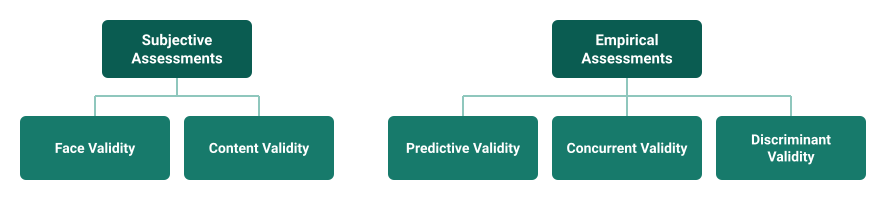

Some sort of quantification of the thing we want to study is necessary if we want to objectively compare things in a systematic way. Without measurement, we can't do science. So, after the Big Five was discovered, people began developing tools to specifically measure a person's standing on the traits of Extraversion, Agreeableness, Neuroticism, Conscientiousness, and Openness. Measurement of personality traits like the Big Five or HEXACO traits would, in theory, allow researchers to use their knowledge of a person's personality to predict things like behavior and life outcomes. The most common way of measuring personality traits in psychology is through lists of questions called "scales" or "inventories".

Personality inventories are typically made up of a set of questions or statements (items) that are designed to assess thoughts, behaviors, and feelings (e.g., "I often feel scared"). Respondents are typically asked to rate their agreement with each item on a Likert-style scale (e.g., strongly agree, agree, neutral, disagree, or strongly disagree); these categorical judgements are then assigned numbers by researchers for analysis (e.g., 1, 2, 3, 4, 5). The numerical values for responses to items that are intended to measure a common personality trait are aggregated together to obtain a score for each subject on the set of personality traits measured by the inventory.

But do these inventories measure the Big Five traits as intended?[^c04-1] How can we know? In this chapter, we'll discuss measurement matters---mainly reliability and validity---because measurement matters if we want accurate estimates of a person's personality. We'll first examine the concepts of reliability and validity. Then we'll explore some common tests for evaluating each and see how common Big Five inventories fare in these tests.

## The Relationship Between Reliability and Validity

Before we get into the details of reliability and validity, let's examine how they relate to each other and to the process of measurement. Reliability is about being consistent -- when we measure something more than once, we should get similar scores each time. Validity, on the other hand, ensures we're measuring what we actually want to measure. Both reliability and validity are key parts of accurate measurement.

**Reliability** is like the first building block of measurement. We want our measuring tool to give us roughly the same estimate every time we use it, assuming the thing we're measuring hasn't changed. For example, we wouldn't want a ruler that gave different estimates of an objects length each time we measure it; and we don't want a personality inventory that gives drastically different estimates of a person's personality traits each time we measure them.

But getting reliable measurement just tells us that we can measure *something* consistently. It doesn't tell us what that something is. That's where validity comes in.

**Validity** helps us determine if we're really measuring what we intended to measure. For instance, if we're trying to measure Extraverted someone is, we want our measurement to reflect that trait and only that trait. We don't want our measurement tool to also estimate other traits like Openness or what our subject had for breakfast. Reliability is crucial, but it's not the whole story -- we need validity too.

To put it simply, reliability is like the foundation of a good measurement tool. It sets the stage for consistency, but we also need validity to make sure we're measuring the right thing accurately. Put another way, reliability is *necessary but not sufficient* for good measurement. When we have both reliability and validity, however, we can be more confident that we've got ourselves a meaningful measurement tool and that the measurements we derive from it mean what we think they mean.

## Reliability Assessment

How can we assess the extent to which a measurement tool gives consistent estimates? There are many methods for assessing reliability. We'll explore the main one's that have been used to examine the reliability of personality inventories: test-retest reliability, inter-item reliability, and inter-rater reliability.

All the reliability assessment methods we'll look at are based on correlations. I'm going to mostly assume here that you know what a correlation is, but here is a quick summary. Correlations summarize the overlap between variables. The correlation coefficient is bounded between -1 and +1. The closer a correlation is to 1, whether it's negative 1 or positive 1, the stronger the correlation is---or the more overlap there are between the two constructs. A correlation of zero means that there is absolutely no relationship or overlap between constructs, so the closer a correlation coefficient is to zero, the less strongly related they are. The positive and negative sign of the correlation coefficient tells us the direction of the relationship. If the sign is positive, then it means there is a positive correlation between variables, i.e., when one variable tends to be high, the other tends to be high as well. If the sign is negative, it means the correlation is negative, i.e., when one variable is high, the other tends to be low. When it comes to reliability assessments, we typically want to see strong correlations as evidence.

### Test-Retest Reliability

Test-retest reliability assesses the stability and consistency of a measurement over time. It involves administering the same measurement to the same individuals on separate occasions. A strong positive correlation indicates that the measurement tool consistently captures something---but not necessarily the thing we want to measure---across different points in time. These measurement occasions can be separated by any amount of time deemed appropriate by the researcher, whether that's minutes, hours, days, weeks, months, or years.

Assuming the researcher doesn't think that personality changes much in the time frame, the scores obtained from the different measurement attempts should show high correlations if the measurement instrument is reliable. Note that assessing test-retest reliability depends on whether we think personality changes much and how quickly it might change.

For common Big Five inventories, the test-retest reliability is quite high. The table below shows the average test-retest reliabilities for each of the Big Five traits 74 studies (Gnambs, 2014). This kind of aggregation of results from many studies is called a meta-analysis.

+----------------------+-------------------------------------------+----------------------------+
| Dimension            | Average test-retest *r* across 74 studies | *SD* of *r* across studies |
+======================+:=========================================:+:==========================:+
| Extraversion         | 0.834                                     | 0.081                      |
+----------------------+-------------------------------------------+----------------------------+
| Agreeableness        | 0.766                                     | 0.097                      |
+----------------------+-------------------------------------------+----------------------------+
| Conscientiousness    | 0.817                                     | 0.067                      |
+----------------------+-------------------------------------------+----------------------------+
| Neuroticism          | 0.802                                     | 0.089                      |
+----------------------+-------------------------------------------+----------------------------+
| Openness             | 0.802                                     | 0.077                      |
+----------------------+-------------------------------------------+----------------------------+

: Test-retest reliability of Big Five measures {#tbl-retest}

*Note:* reproduced from Gnambs (2014).

Across all of the Big Five traits, the expected reliability of a test is about .82. That's pretty high! Further, the small standard deviation (SD) values in the 3^rd^ column indicate that there is not very much variation across studies. Many of these 74 studies used different inventories to measure the Big Five and had different time intervals between measures, but they all had generally high consistency. Tests that had more items tended to have somewhat better test-retest reliability.

This meta-analysis found that studies with longer times between tests typically had lower test-retest reliability than studies with less time between tests. But in general, reliabilities were still high, even for tests two months apart. In a later chapter we will explore more about how personality changes over time, so it isn't necessarily a problem if reliability is lower over longer periods of time. We sort of expect that unless you think personality is perfectly fixed across time (some researchers do).

### Inter-Item Reliability

Inter-item reliability evaluates the internal consistency of a multi-item scale or questionnaire designed to measure a specific construct. It examines how well the individual items within the scale correlate with one another. This is typically assessed using methods like Cronbach's alpha, which you'll see in many papers indicated by its Greek letter, α. A high inter-item correlation suggests that the items are repeatedly measuring a similar thing---ideally the same thing. If we have very low correlations among our items, it may suggest that they are not good items.

Note that inter-item reliability is largely dependent on the number of items we put in a scale and how similarly they are worded: scales with more items, especially more similarly phrased items, will tend to have stronger inter-item reliability. This means that if we are trying to measure several partially distinct aspects of a personality trait with only a few items, our inter-item reliability might be low even though the questions do a good job of measuring the trait. Even though higher inter-rater reliability is typically better, we need to think carefully about what we are intending to measure if we want to make good judgments about inter-item reliabilities.

For most Big Five measures, inter-item reliability is very high. The table below shows the inter-item reliability coefficient (alpha, α) for the IPIP-50, which I administered to students on the first day of class. This high reliability is typical of most Big Five scales, especially longer ones. Similar alpha coefficients are found for most HEXACO inventories, except for ones with very few items per dimension (e.g., de Vries, 2013).

+--------------------------------+-------------------------------------+
| Dimension                      | Inter-item reliability (α)          |
+================================+:===================================:+
| Extraversion                   | 0.91                                |
+--------------------------------+-------------------------------------+
| Agreeableness                  | 0.70                                |
+--------------------------------+-------------------------------------+
| Conscientiousness              | 0.78                                |
+--------------------------------+-------------------------------------+
| Neuroticism                    | 0.77                                |
+--------------------------------+-------------------------------------+
| Openness                       | 0.80                                |
+--------------------------------+-------------------------------------+

: Inter-item reliability for the in-class Big Five personality test. {#tbl-inter-item}

### Inter-Rater Reliability

Inter-rater reliability gauges the level of agreement or consistency among different raters or observers when evaluating a particular phenomenon or behavior. People can have different perceptions of most psychological outcomes, especially personality, so we want to be able to assess how much estimates from personality inventories differ from person to person. High inter-rater reliability scores signify a high level of agreement among the raters, enhancing the confidence in the accuracy and consistency of the measurements.

When it comes to personality inventories, most inter-rater reliability estimates come from having two (or more) people rate one other person. Or comparison's will be made between a person's self-assessments on the inventory with assessments of that person made by others who know them (e.g., friends, coworkers, romantic partners).

For the Big Five personality inventories, inter-rater reliability is typically moderately high. Across a range of studies that compared the consistency between different peoples' perceptions of another person's personality, the average inter-rater reliability was about .4 (Vazire & Carlson, 2013). That means that inter-rater reliability is far from perfect (a correlation of 1). However, it makes sense that people would have different assessments of another person's personality---we all have different bits of incomplete information that we interpret using our own perspectives. What's more reassuring is that relationship length and closeness seems to predict stronger agreement between a person's self-rated personality and their friend's or romantic partner's ratings (Watson et al., 2000).

Interestingly, even in a first meeting, people may even be able to judge others' personality with some accuracy. To illustrate this, I have students talk to each other a little bit on the first day of class without any real guidance or direction. After talking, each pair of students rate each other on each of the Big Five dimensions. I then compare those ratings from brief interactions to the students' self-ratings on a longer personality test. The table below shows the correlations between students' self-rated personality traits and their partners' perceptions of their personality from their brief interactions. Clearly, the accuracy of these students' perceptions is not very high, but also it is indeed better than chance in most cases (e.g., extraversion and agreeableness).

+------------------------------+-------------------------+--------------------------+------------------------------+------------------------+---------------------+
|                              | Self-rated Extraversion | Self-rated Agreeableness | Self-rated Conscientiousness | Self-rated Neuroticism | Self-rated Openness |
+==============================+:=======================:+:========================:+:============================:+:======================:+:===================:+
| Peer-rated Extraversion      | **0.47**                | 0.35                     | 0.23                         | 0.01                   | 0.33                |
+------------------------------+-------------------------+--------------------------+------------------------------+------------------------+---------------------+
| Peer-rated Agreeableness     | 0.15                    | **0.26**                 | 0.19                         | 0.15                   | 0.07                |
+------------------------------+-------------------------+--------------------------+------------------------------+------------------------+---------------------+
| Peer-rated Conscientiousness | 0.22                    | 0.17                     | **0.00**                     | 0.18                   | 0.12                |
+------------------------------+-------------------------+--------------------------+------------------------------+------------------------+---------------------+
| Peer-rated Neuroticism       | 0.11                    | 0.16                     | 0.06                         | **0.24**               | 0.01                |
+------------------------------+-------------------------+--------------------------+------------------------------+------------------------+---------------------+
| Peer-rated Openness          | 0.22                    | 0.25                     | 0.15                         | 0.18s                  | **0.08**            |
+------------------------------+-------------------------+--------------------------+------------------------------+------------------------+---------------------+

: Correlations among self-rated personality traits and peer-rated personality traits from a brief interaction {#tbl-self-peer}

*Note:* Based on a sample of 112 students from three classes across two semesters.

There is a whole huge area of research exploring how and why people's perceptions of others' personality may differ and how these perceptions change over time, which we may be able to explore in a later chapter. For now, we should just recognize that self-other and even other-other agreement is not very high, but that doesn't necessarily mean there is something wrong with the measures themselves.

## Validity Assessments

So, the reliability of most Big Five tests that are commonly used is typically pretty good. There is strong test-retest reliability across fairly long time periods, there is strong inter-item reliability, and there is moderate inter-rater agreement. I'd be comfortable saying that most Big Five tests are reliable, meaning they can consistently measure something. But again, reliability is not enough---we want to know that we are consistently measuring the specific something that we intend to measure (i.e., Big Five traits). Let's look at some methods for assessing validity and see what the evidence for the validity of Big Five personality inventories looks like.

There are two broad types of validity assessments: *subjective* and *empirical*. Subjective validity tests include face validity and content validity. Empirical validity tests include predictive validity, concurrent validity, and discriminant validity. @fig-validity depicts the relationship between specific validity assessments and each type of validity. We'll explore each of these in more detail in their respective sections below.

{#fig-validity fig-alt="Two hierarchies. Subjective Assessments divides into Face Validity and Content Validity. Empirical Assessments divides into Predictive, Concurrent and Discriminant Validity." width="700"}

### Subjective Validity Assessments

Subjective validity can be assessed without collecting any data or doing any statistical tests. We can all conduct a subjective validity test for any inventory just by looking at it and thinking a bit. We just need a good sense of the *operational definition* of the trait. The operational definition describes the specific thing being measured (e.g., Extraversion) in a way that allows us to determine how the measurement tool can achieve measurement. Let's take a closer look at face validity and content validity.

#### Face Validity

Face validity is an initial, subjective evaluation of whether a measurement tool appears, "on its face", to measure the intended construct accurately. It assesses whether the items or questions in the instrument seem relevant and appropriate to the construct being measured.

Assessing face validity is like judging a book by its cover. It's a quick, intuitive assessment of whether a measurement tool appears to measure what it's supposed to. Just as you might get a sense of a book's content by looking at its cover and title, face validity is about the inventory items looking like it measures what it is supposed to measure.

However, face validity isn't always desirable. Sometimes we don't want subjects to know exactly what is being measured. For example, if we were to try to measure psychopathic traits using a self-report scale, we might not want it to be obvious because then a good psychopath could just lie to us if they don't want to be measured. However, we should always consider the face validity of our measure because it likely that our subjects will make some guesses about what we are measuring and those guesses can affect their responses---so by considering what it looks like we are measuring, we might be able to better interpret participant responses.

#### Content Validity

Content validity is a systematic and comprehensive assessment of how well the items in a measurement tool represent the construct being measured. It involves judgment to ensure that the items adequately cover all aspects of the construct.

Content validity is like making sure you have all the pieces of a puzzle that you are trying to put together. If you are missing jigsaw pieces, the puzzle will, at best, be incomplete; and if you're missing too many pieces you may not even be able to produce anything that looks like the picture you intended to produce (i.e., measure the thing you intended measure). We want to make sure our questions in an inventory (corresponding to puzzle pieces) provide complete coverage of our trait (corresponding to the puzzle picture).

### Empirical Validity Assessments

Empirical tests require us to collect some data and run some statical tests. This doesn't necessarily mean they are purely objective tests; researchers must still make subjective interpretations of the statistical results to determine what sort of evidential value they have. Let's take a closer look at the empirical validity assessments: criterion/predictive validity; concurrent/convergent validity; and discriminant/divergent validity.

#### Criterion (Predictive) Validity

Criterion validity, also known as predictive validity, refers to the extent to which a measurement tool accurately predicts or correlates with a specific outcome that theory predicts it should be closely related to. It involves comparing the scores obtained from the measurement tool with the scores on an established criterion, and ideally demonstrating a strong relationship between them.

Criterion validity can be likened to hitting the bullseye in darts or archery. Imagine hitting the center of the target accurately is your goal. Criterion validity provides a way to measure how close or far your throws (measurements) come to hitting the bullseye. Or if you have a crystal ball that is supposed to predict the future, the predictive validity would be indexed by how many times the crystal ball actually predicts the future.

For personality inventories, the predictive utility typically comes from looking at how well scores on inventories predict behavior that should be relevant to a given trait. There have been many studies looking at this.

For example, in 1989 David Buss (my PhD advisor) and Mike Botwin (my colleague at Fresno State), asked people to report how often they engaged in various behaviors that were theoretically reflective of different personality traits. Then they compared the behavioral reports to the scores on a Big Five inventory. They found that the behaviors that people reported engaging in tended to be moderately correlated with relevant inventory scores for the Big Five traits. The table below gives some examples of the behaviors that go with each trait and their specific correlations with each.

+----------------------+-------------------------------------------------------------------------+----------+
| Big Five Scale       | Example Criterion Acts                                                  | Mean *r* |
+======================+=========================================================================+:========:+
| Extraversion         | Dancing in a crowd, telling jokes                                       | 0.51     |
+----------------------+-------------------------------------------------------------------------+----------+
| Agreeableness        | Offered to help a friend move, glared at a stranger (-)                 | 0.53     |
+----------------------+-------------------------------------------------------------------------+----------+
| Conscientiousness    | Didn't review work (-), saved money                                     | 0.54     |
+----------------------+-------------------------------------------------------------------------+----------+
| Neuroticism          | Worried about something out of control, put self down                   | 0.37     |
+----------------------+-------------------------------------------------------------------------+----------+
| Openness             | Went to an art exhibit, discussed an issue from multiple points of view | 0.45     |
+----------------------+-------------------------------------------------------------------------+----------+

: Correlations between Big Five scale scores and reported behaviors {#tbl-behaviors}

*Note*: reproduced from Buss & Botwin (1989)

Other studies have looked at even more stringent behavioral criterion by measuring behavior directly, rather than relying on self-reports. This is important because it is possible that self-reported behaviors are biased by personality. For example, extraverts could be more likely to remember and report talking to people. This may lead us to overestimate correlations between behavior and personality scores.

Indeed, when we examine studies that directly measure behavior, the correlations with inventory scores are typically smaller. A meta-analysis of correlations between personality test scores and directly measured behavior---either in lab settings or in more naturalistic settings---found that the average correlation between an inventory score for each of the Big Five and an associated behavior was around .25 (Vazire and Carlson, 2010). This is quite a bit smaller than the self-reported behavior correlations, but it does still provide evidence that self-reported inventory scores are picking up on actual differences in behavioral tendencies.

####

#### Concurrent (Convergent) Validity

Concurrent validity---sometimes called convergent validity---involves comparing a new inventory with an existing, well-established inventory that measures the same construct. To do this comparison, the different inventories are typically administered to a group of people at the same time, so that we have scores for everyone on both inventories, allowing us to assess their correlation. Ideally, we want very high correlations on inventories that are supposed to measure the same thing. For example, different Neuroticism inventories should be highly correlated, as should different Openness measures.

Maybe you can find it easier to remember concurrent validity by thinking about its root word "concur". If someone---like an old-timey judge in a Mississippi courtroom---says "I concur" (in a thick southern accent), it means they agree. When we examine concurrent validity, we are looking for measures of the same construct to agree with each other in the estimates they produce. Alternatively, for remembering convergent validity, you can use the root "converge". When rivers come together, we say they converge. When we assess convergent validity, we want our two measures to come together on the same estimates.

When it comes to personality inventories, convergent validity is typically assessed by comparing new measures to some older established Big Five inventories. For example, when the HEXACO personality inventory was created, the authors had to establish that their inventories for traits that had clear overlap with the Big Five traits (e.g., Extraversion, Openness), were indeed highly correlated with those traits. So, they administered their HEXACO inventory to people along with an existing Big Five inventory and found the correlations shown in the table below.

| HEXACO scales | Neuroticism | Extraversion | Agreeableness | Conscientiousness | Openness |
|:---|:---:|:---:|:---:|:---:|:---:|
| Honesty-Humility | -0.08 | -0.14 | 0.28 | 0.09 | 0.13 |
| Emotionality | **0.55** | 0.01 | 0.34 | -0.06 | 0.11 |
| Extraversion | -0.14 | **0.74** | 0.13 | 0.1 | 0.21 |
| Agreeableness | -0.37 | -0.16 | **0.52** | -0.09 | 0.03 |
| Conscientiousness | 0.02 | 0.03 | 0.01 | **0.7** | 0.2 |
| Openness | -0.03 | 0.07 | 0.12 | -0.1 | **0.76** |

: Correlation between HEXACO inventory scores (rows) and Big Five inventory scores (columns) {#tbl-hexaco}

*Note:* reproduced from Lee & Ashton (2004)

The most relevant correlations to examine in this correlation matrix are the bolded correlations that depict the correlations between each HEXACO trait and its Big Five counterpart (e.g., HEXACO emotionality and Big Five Neuroticism). For the most part, there are strong correlations between the HEXACO traits and their corresponding Big Five traits.

Another application of convergent validity is when researchers make a shorter scale to measure Big Five traits. Older Big Five inventories typically have many questions---sometimes hundreds---and they take a long time for participants to fill out. That makes it hard to get a lot of good data because most people don't want to spend a long time filling out surveys. So, researchers often try to make shorter scales to reduce the burden on participants and make it easier to collect data. But when we do that, we need to understand how it changes our measurements. In order to do that, researchers will typically administer the new shortened inventory in tandem with a longer inventory to assess the correlations among their scores. For example, Gosling et al. made a very short 5-item scale that measures each Big Five trait with just one item. They found that the scores from single items were moderately correlated with scores from a longer inventory (ranging from around .8 for Extraversion to .48 for Openness). This information can help researchers evaluate the tradeoffs of longer versus shorter measures in their own research.

####

#### Discriminant (Divergent) Validity

Discriminant validity---sometimes called divergent---is the degree to which a measurement tool accurately distinguishes between the construct it's intended to measure and other unrelated constructs that it isn't supposed to measure. It ensures that the tool does not measure other irrelevant traits, demonstrating its ability to discriminate between different concepts or variables.

You may find it helpful to remember that discriminant validity has the root "discriminate". While it generally isn't cool to discriminate (e.g., against people), when it comes to measurement, we definitely want to discriminate. That is, want our measurement inventories to discriminate against the traits that we are not trying to measure by not measuring them---only the trait we want to measure should be allowed into our estimates of the trait.

For personality inventories, discriminant validity is often used to argue that a given inventory measures something different from what is already captured in the Big Five. For example, the HEXACO creators argued for the importance and novelty of the Honesty-Humility dimension by showing that it was largely uncorrelated with scores on Big Five dimensions (see the correlations in @tbl-hexaco above). This suggests that it is capturing something new. Additionally, we can learn from HEXACO correlations with Big Five scores that Agreeableness and Emotionality in the HEXACO inventory are somewhat different from Agreeableness and Neuroticism in the Big Five inventory, since they share only about half of their variance.

It is also important that Big Five scores are mostly uncorrelated with one another as well---we don't really want Extraversion scores to be picking up on Neuroticism or Openness because that makes it harder to interpret what they mean. In reality, however, it is often the case that scores in different personality dimensions are correlated at least a little bit, perhaps due to some self-report biases. This phenomenon is often attributed to a mythical "crud" factor that accounts for confounds that might drive correlations among scores from inventories in psychology.

## What's the Verdict? Do Personality Inventories Measure What They Intend To?

In this chapter we've examined the important components of measurement, reliability and validity. We learned how to assess information about inter-rater reliability, test-retest reliability, and inter-item reliability, which is necessary but not sufficient for measurement. Then, we learned how to evaluate the validity of a measure by testing criterion validity, convergent validity, and discriminant validity.

I gave you some representative evidence for each of these aspects of reliability and validity for Big Five and HEXACO inventories. At this point, you should be able to form your own informed opinion about what these personality inventories measure, as well as evaluate future personality measurement tools using the same criteria. But I'd encourage you to avoid being too dichotomous about our decisions. Just like personality traits themselves, reliability and validity exist on a continuum and we have to consider each measurement tool in relation to others that are available.

In my opinion, there seems to pretty strong reliability indicating that the inventories measure something fairly consistently. And there is some evidence that scores on these inventories predict real world behaviors that are relevant to each personality trait, albeit far from perfectly. A skeptical but reasonable interpretation could be that these inventories provide useful information about personality, but they don't necessarily measure personality directly. That is, they are useful proxies of personality traits.

I think we should view existing personality inventories as practically useful tools, but we should not stop trying to develop more precise measurement methods. It seems unlikely to me that the common inventory approach---which was pretty much our first attempt at systematically measuring personality traits---will be the best we can do. We should continue to explore potential alternatives. Maybe you can help us develop some!

But for now, most of what we know about personality is based on inventory-like measures. So, most of the research we'll talk about throughout the rest of the course will largely be based on these sorts of measures. We should keep this in mind as we evaluate the findings from different areas of research.

## References
Gnambs, T. (2014). A meta-analysis of dependability coefficients (test--retest reliabilities) for measures of the Big Five. *Journal of Research in Personality*, *52*, 20-28.

Lee, K., & Ashton, M. C. (2004). Psychometric properties of the HEXACO personality inventory. *Multivariate behavioral research*, *39*(2), 329-358.

Vazire, S., & Carlson, E. N. (2010). Self‐knowledge of personality: Do people know themselves?. *Social and personality psychology compass*, *4*(8), 605-620.

Watson, D., Hubbard, B., & Wiese, D. (2000). Self--other agreement in personality and affectivity: The role of acquaintanceship, trait visibility, and assumed similarity. *Journal of personality and social psychology*, *78*(3), 546.

[^c04-1]:
The name for this chapter is shamelessly borrowed from: [https://www.psychologicalscience.org/observer/measurement-matters](https://www.psychologicalscience.org/observer/measurement-matters)
