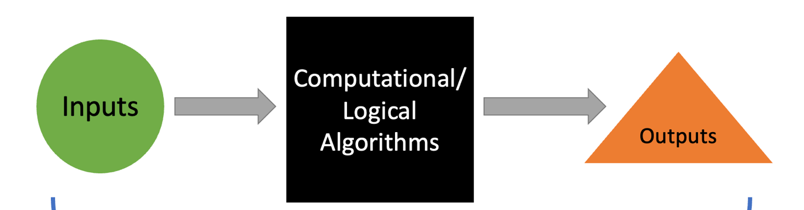

Now that we have a decent taxonomy of personality traits for focusing our attention (i.e., the Big Five), we can begin to ask interesting questions about them. In this chapter we will turn our focus to an *ultimate* question: Why do these personality differences exist?

To begin to answer this question, we need to first have an understanding evolution. This is because evolution is the best scientific theory developed for explaining why living things are the way they are. Humans have long observed that living organisms, like plants and animals, are typically very well suited to survive and reproduce in the habits they live in. It often seems as though organisms are *designed* for their specific habitats. Evolutionary theory provides us a framework for understanding why this is the case.

## Darwin's Big Ideas

The theory of evolution was developed by Charles Darwin in the mid 1800s. He spent years traveling around the world and observing the wondrous diversity of animals and plants across many exotic habitats, like the Galapagos Islands. Based on his observations, he argued that all living organisms share a common ancestry and proposed that a simple process could explain the vast diversity of organisms we observe today. The simple process he proposed is called *natural selection*.

### Natural Selection

Natural selection depends on three conditions: *variation*, *differential reproduction,* and *inheritance*. In self-replicating populations---whether that self-replication is sexual or asexual---these three ingredients inevitably lead to changes in the frequencies of traits within the population over time. We'll explore what these conditions are in detail below.

#### Variation

In any population (e.g., a crash of rhinos, an exaltation of larks, a tower of giraffes[^1]), individuals are slightly different from one another. Individuals within populations differ from one another in countless ways: body size, musculature, hunger, adventurousness, aggressiveness, furriness, speed, sleepiness, etc. All the traits that an organism possesses make up its *phenotype*. So, individuals within populations have somewhat different phenotypes. This phenotypic variation eventually leads to some traits becoming more prominent in a population because of differential selection and inheritance.

#### Differential reproduction

Some individuals within populations reproduce more than others and some don't reproduce at all. Sometimes individuals fail to reproduce because they die from some completely random accident. But individuals also fail to reproduce because there is something about their phenotype that led them to die before reproduction or to be unsuccessful in finding or copulating with a mate. Put another way, some individuals possess traits that make it harder to survive and reproduce in their habitat, while some individuals have traits that make it easier to survive and reproduce. For example, a slower adolescent gazelle might be more likely to be caught by a cheetah before they have a chance to mate; or a more brilliantly colored bird might be more noticeable than a duller bird, leading them to be detected more easily by potential mates and giving them more reproductive opportunities than duller birds. The degree to which an individual organism has traits that allow it to successfully survive and reproduce in their environment better than other individuals is referred to as differences in *fitness.*

Some of the phenotypic variation in the population is causally linked to survival and reproduction. In other words, some individuals possess phenotypes that make it more likely that they will survive and reproduce, while others possess phenotypes that make it less likely that they will survive and reproduce. This is where the "selection" in natural selection takes place. But variation and differential reproduction alone isn't enough to produce evolution without the traits being passed down to the next generation of replicates in some way.

#### Inheritance

The final condition necessary for evolution to happen is inheritance. Inheritance allows the phenotypic traits that produce better chances of survival and reproduction (i.e., the traits with more fitness) to be passed on to the next generation of replicates (e.g., offspring). That means the traits must be *inheritable*.

Humans have recognized for a very long time that the offspring tend to resemble their parents. So, we've known for a long time that parents could pass on some traits to offspring. In Darwin's time, however, they didn't know about genes or even how exactly traits got passed on---in fact they thought that parents' traits got blended somehow, like mixing paints. But Darwin knew this wouldn't be enough for the fitness-enhancing traits to be preserved generation after generation. It turns out that around the same time that Darwin was developing his theory, Gregory Mendel was actively conducting research on inherited traits in pea plants which ultimately led to our modern understanding on how traits are passed on generation after generation.

Nowadays, we know that parents' traits can be inherited by offspring via *genes*. Due to a process called recombination, offspring receive a random set of genes from each parent, which allows traits to be preserved across generations under certain conditions. Thus, parents who possess traits that make it easier to survive and reproduce will tend to produce offspring that possess those traits as well.

### Natural Selection in Action

When the three conditions of variability, differential reproduction, and inheritance are present in a population of self-replicating individuals, fitness-enhancing traits tend to become more common. Usually, the changes in a population occur very slowly across many generations. Sometimes they can happen faster.

A famous example evolution is finches on the Galapagos Islands that inspired Darwin's theory. These finches exhibit remarkable variation in their beak shapes, and this variation corresponded closely to their dietary preferences and feeding behaviors. Some had slender, probing beaks suitable for capturing insects, while others had sturdy, crushing beaks for consuming seeds or cracking nuts. These variations in beak shape were advantageous for the finches' survival and reproduction within their ecological niche.

Over generations, this process of natural selection led to an increase in the frequency of the advantageous beak shapes within each finch population. These changes occurred relatively slowly but were nonetheless observable over time. Darwin's observations of the finches and their adaptive evolution provided crucial evidence for his theory of natural selection, demonstrating how small, gradual changes in traits within a population could lead to significant evolutionary shifts over extended periods.

### Sexual Selection

Darwin's was a careful thinker and was always looking for ways to disprove his theory evolution. Apparently, he was somewhat tormented by the existence of traits that do not appear to directly support survival or even hinder survival, such as the peacocks long and cumbersome tailfeathers. How could something like that evolve if natural selection was the only process operating on traits?

Eventually, Darwin came up with a solution to this puzzle. He proposed a second evolutionary process, called *sexual selection*, which operates somewhat differently than natural selection. Sexual selection is a specialized form of natural selection whereby characteristics that improve success in competing to attract a mate become more common in a population, even if those traits aren't directly useful for survival---sometimes, traits can even harm survival and still be maintained via sexual selection. There are two mechanisms of sexual selection: *intra*-sexual competition and *inter*-sexual choice.

#### intra-sexual Competition

Intrasexual competition involves members of one sex (usually males) competing for access to the opposite sex (usually females). This competition can take various forms, such as physical combat, displays of strength, or contests of endurance. The winners of these competitions often gain preferential access to mates and reproductive opportunities.

Because of this competition being directly tied to reproductive success, any traits that provide a competitive advantage will tend to become more common in a population, assuming that the traits are inheritable. So, over long periods of time, traits like antlers, horns, and thicker skin have evolved in the sex that typically competes for mates (usually males) across many species. Many of these traits do not directly aid in survival. For example, male deer only grow antlers during the mating season, indicating that they are not used for protection in a general sense.

#### Inter-sexual choice

Intersexual choice, also known as mate choice, involves members of one sex (often females) choosing mates based on certain preferred characteristics. These characteristics, often referred to as "ornaments" or "indicators of fitness," can include physical traits, behaviors, or social status. Sometimes, however, the preferences are somewhat arbitrary. Individuals with preferred traits are more likely to be chosen as mates, allowing them to pass their traits to the next generation.

Sexual selection often leads to the development of exaggerated traits that are not directly related to survival but are favored because they appeal to the opposite sex. This can result in elaborate courtship displays, colorful plumage, or intricate behaviors that enhance an individual's attractiveness to potential mates. The peacock tail and complex bird songs are classic examples of traits that likely evolved via inter-sexual choice.

## Products of evolution

Evolution is ultimately just a change in frequencies of traits (and their associated genes) in a population over time. There are three main products of evolutionary processes: adaptations, byproducts, and noise.

### Adaptations

Adaptations are traits that evolve because they aided in survival and reproduction. Put another way, adaptations are functional, like a tool. Adaptations are for doing things. Because traits that reliably aid in survival and reproduction tend to become more common in the population, adaptations are generally species-typical and reliably developing---all or most members of a population (e.g., species) will develop the trait. An example of an adaptation is the umbilical cord that transports nutrients to a fetus from its mother during gestation.

### Byproducts

Byproducts are traits that are not directly shaped by evolutionary processes, but they are somehow linked to adaptations. These may have initially emerged due to selection for a different trait or due to genetic or developmental constraints. Byproducts can persist in populations as they do not impose a significant fitness cost and are not actively selected against. Byproducts are non-functional, meaning that they do not directly aid in survival and reproduction. An example of a byproduct is the bellybutton. The bellybutton doesn't serve any function itself after gestation. It is a byproduct of the umbilical cord.

### Noise

Noise refers to variation in traits that evolves and is not selected out by evolutionary processes because it is not tied to survival and reproduction. This noise is not part of the design of an organism. For example, peoples' bellybuttons vary in terms of size and appearance, but the size and appearance of bellybuttons doesn't matter for survival and reproduction on average. Noise, or random variation in traits, is inevitable because of random genetic mutations and environmental influences on traits. This variation is also a key driver of evolution because it can produce variants of traits that improve fitness (i.e., survival and reproduction).

## The power of evolutionary theory

Understanding the mechanisms and products of evolution, particularly natural and sexual selection, unveils the intricate tapestry of life. It allows us to comprehend how and why living organisms seem to fit so well within their natural habitats. Natural selection illustrates how subtle variations, advantageous or otherwise, influence survival and reproduction, shaping species over generations. Moreover, sexual selection illuminates the role of mate preferences and competition, driving the development of striking traits and behaviors that might seem unrelated to survival but profoundly impact a species' evolutionary trajectory. Together, these mechanisms produce adaptations, byproducts, and noise. Evolutionary theory provides a powerful lens through which we can fully appreciate the breathtaking diversity and complex interplay of life on Earth. In the next section, we will explore how it may also allow us to better human psychology as well.

## Applying Darwin's Ideas to Humans: Evolutionary Psychology

Evolutionary Psychology (EP) is relatively new approach to studying the mind and behavior. At its core, EP is about applying evolutionary theory to understand the mind and behavior. This approach posits that many---but not necessarily all---aspects of human psychology and behavior exist because they enhanced our survival and reproduction in ancestral environments. The main focus of EP are *evolved psychological mechanisms.*

### What the #@%! is a psychological mechanism?

A psychological mechanism is an abstract term to describe a hypothetical information processing system in the mind. I like to think of psychological mechanisms as biologically based computer programs that are each designed to do a particular task. Psychological mechanisms are typically hypothesized to take some inputs and produce some outputs (e.g., behavior) based on some set of (logical or numerical) algorithmic procedures. So, they have a structure like the one depicted in @fig-mechanism.

{#fig-mechanism fig-alt="Flow diagram: Inputs, shown as a circle, feed into a box labelled Computational/Logical Algorithms, which feeds into Outputs, shown as a triangle." width="600"}

The **inputs** to a psychological mechanism could be features of a situation, sounds, light refracting off objects. It depends on what the psychological mechanism evolved to do (i.e., what its function is). The inputs could even be outputs from other psychological mechanisms.

The psychological mechanism then performs some **computation** on the input(s). Just like a computer program, the computation dependents on what the mechanism is designed to do. Some algorithms might be analogous to adding numbers together; some might be more like conducting a regression analysis; and some might be more logical rules like "if snake is detected, run away".

Ultimately, these computations produce some **outputs** in the form of behaviors, thoughts, or information that is transmitted to other psychological mechanisms. Evolutionary psychology posits that evolved psychological mechanisms are specially designed to produce outputs that would have helped our ancestors survive and reproduce. Put another way, the outputs are supposed to help an organism solve an adaptive problem---we'll unpack this term in the next section.

To fully understand a psychological mechanism, we would want to eventually be able to provide a description for each of Marr's levels, which we covered in the Foundational Frameworks chapter. The computational level explanation would describe what the psychological mechanism is for, or what its function is, by identifying to an *adaptive problem* it is solves. The algorithmic level would describe the form of algorithm that transforms inputs to outputs. And the implementational level would describe how such computations are physically instantiated in our brains (or perhaps another physical substance).

### What the #@%! is an adaptive problem?

Adaptive problems refer to the challenges and obstacles to survival and reproduction that our ancestors faced in their ancestral environments. Adaptive problems are challenges that would have needed to be reliably overcome generation after generation throughout our evolutionary history---often going back even before humans evolved. These problems encompass a range of fundamental concerns such as finding food, shelter, forming alliances, selecting mates, caring for offspring, avoiding predators, and navigating social hierarchies.

Evolutionary Psychology posits that solving these adaptive problems would require a sophisticated array of psychological mechanisms, each of which are designed to solve a particular subproblem. EP attempts to reverse engineer these psychological programs by conducting task analyses---a step by step set of instructions for all the little subgoals that need to be met in order to solve the broader adaptive problem. These task analyses can lead to novel predictions about the features of the human mind that can be tested in empirical studies. Ultimately, using adaptive problems to guide our study of human psychology sheds light on the evolved traits and behaviors that continue to shape human cognition and actions in contemporary societies.

[^1]:
Yes, these really are the names for groups of these animals!
