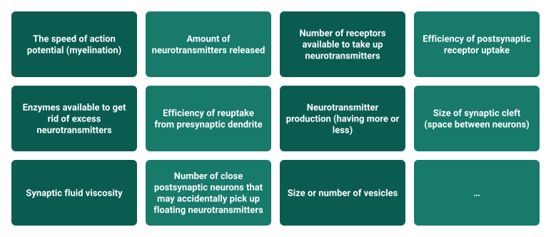

In the last chapter, we learned that genetics explains a significant portion of variation in personality and that the genetics of personality are far from simple. There are many, many genes that influence personality---and any single gene has only a very tiny effect.

The effects of genetics on personality must be mediated by our physiology. Genes are simply rough instructions for making proteins that build our brain and body[^1]. The resulting subtle differences in our physiology contribute to personality differences. Put another way, physiological differences in brains and bodies are what links genetic differences to personality differences.

In this chapter, we'll begin to explore how physiology relates to personality. Unfortunately, it will soon become clear that there are usually not easy or simple answers when it comes to how differences in brains and bodies are related to average differences in thoughts, feelings, and behavior. But I think it's important to recognize this complexity to avoid falling for overly simplistic explanations that boil personality differences down to simple physiological factors. Personality traits are complex phenomenon, and we should probably not expect that their physiological underpinnings are simple or straightforward.

We'll start with brains before moving to our bodies more generally. But let's not mistake this topic separation for biological reality. Minds, brains, and bodies are not distinct things. Our "mind" is a construct we use to describe the set of operations performed by our brain. Our mind is a product of our brain, and our brain is part of our body. Ultimately, explaining how physiology relates to personality will require understanding our bodies as a whole unit with interacting parts.

## Brains

### What is a brain?

Our brains are a highly sophisticated web of interconnected *neurons*. Neurons are a specialized form of nerve cell. They are the primary functional unit in the brain. The average human brain has 86 billion neurons (Herculano-Houzel, 2012). Each neuron can be connected to around 10,000 other neurons. That means that there are potentially trillions of neural connections in the human brain! This complexity, and the resulting potential for an immense number of possible configurations of brain activity or "brain states".

Neurons are responsible for receiving, transmitting, storing, and performing computations on sensory information from the external world, as well as information produced in the brain. They do this by communicating via their connections to other neurons. Neurons communicate with other neurons primarily using electrochemical signals called action potentials and chemical messengers called neurotransmitters. All our thoughts, feelings, motivations, behaviors, and memories are products of this neuronal communication.

Neurons are generally composed of a cell body with dendrites, an axon lined with myelin, and an axon terminal. Dendrites receive signals from other cells and transmit information as an electrical signal down the axon to the axon terminal. This transmission of energy from the dendrites through to the axon terminal is often referred to as the neuron "firing". The axon terminal contains *vesicles,* which are capsules that store neurotransmitters (imagine a gelatin pill capsule that contains powdered medicine) until it is ready to release them.

When a neuron fires, an electrochemical signal travels to the axon terminal and causes vesicles to release neurotransmitters into a space between neurons called the *synapse*. Once in the synapse, neurotransmitters then bind to *receptors* on other neurons to cause them to fire their own action potential. A signal-sending neuron is referred to as a *presynaptic* neuron, and the receiving neuron is referred to as *postsynaptic* neurons. Neurotransmitters and receptors exhibit a "lock-and-key" style relationship, whereby the specific molecular structure of neurotransmitters is a perfect fit for specific receptors.

This electrochemical communication between neurons and larger brain networks is the primary way that computations happen the brain. Because of this, differences in neuronal communication may help us understand how average individual differences in thoughts, feelings, and behavior (i.e., personality) arise.

### Neurotransmitters and personality

There are over 100 types of neurotransmitters. But research in personality has explored on only a small number of these. In this chapter we will focus on two neurotransmitters that have been the subjects of most personality research: serotonin and dopamine.

It's tempting to present individual types of neurotransmitters as having specific and narrow roles in neuronal communication. But reality is much more complex. Neurotransmitters actually have many diverse functions and are typically widely distributed throughout the brain and even nervous system.

**Serotonin**, for example, is involved in a wide variety of phenomena including sleep, mood, digestion and nausea, wound healing, and sexual arousal. Serotonin is linked to depression and anxiety (Stein & Stahl, 2000). Drugs like MDMA create feelings of euphoria by triggering your neurons in particular circuits in your brain to release large amounts of serotonin.

**Dopamine** plays an important role in movement, pleasurable feelings, motivation and addiction, and emotional arousal. Too little dopamine is linked with Parkinson's disease, which is characterized by uncontrollable body movements and shaking. Too much dopamine, in contrast, is associated with schizophrenia which is characterized by hallucinations, delusions, slow movement, and lack of motivation.

Considering the functions of these neurotransmitters, we could make predictions about their relations to personality. For example, we could predict that serotonin would be linked to the personality trait Neuroticism. And perhaps dopamine could be expected to be related to Openness or Extraversion. However, there is little evidence for reliable relationships between these neurotransmitters and personality.

#### Limited evidence for links between neurotransmitters and personality

The strongest evidence for links between neurotransmitters and personality comes from clinical trials of pharmaceutical treatments for depression and anxiety. The first-line treatments for depression and anxiety include a class of drugs called selective serotonin reuptake inhibitors (SSRIs). As the name implies, SSRIs work by preventing presynaptic neurons from taking back serotonin that is floating in the synapse, which allows the postsynaptic neuron's receptors to have more time to bind with the serotonin.

Some research suggests that patients who are assigned to take SSRIs for treatment of depression or anxiety tend to score lower on self-report measures of Neuroticism in post-treatment questionnaires than in the pre-treatment questionnaires (Noordhof et al., 2019). This provides some tentative evidence that differences in serotonin are linked to differences Neuroticism. However, it isn't clear whether differences in serotonin can account for differences in Neuroticism (or other personality traits) in people who are not seeking treatment for depression or anxiety.

#### Complicated relationships may obscure associations

The lack of evidence for clear links between neurotransmitters and personality variation may simply be because there are very few simple or straightforward links between neurotransmitters and personality. The effects of neurotransmitters depend on a multitude of factors. Simply having more or less of a given neurotransmitter does not necessarily mean that it will have more effects. @fig-neuronal highlights some of the many aspects of neuronal communication that could lead to individual differences in the computations that produce behavior, thoughts, and feelings.

{#fig-neuronal fig-alt="Twelve boxes listing sources of variation in neuronal communication, including speed of action potential, amount of neurotransmitters released, receptor availability and reuptake efficiency; the last box is an ellipsis." width="700"}

For example, there are differences in the number of postsynaptic receptors available to take up the neurotransmitters. There are also differences in how long the neurotransmitters stay available in the synapse. This can be caused by differences in the speed with which presynaptic neurons reuptake free-floating neurotransmitters, as well as differences in the speed with which the enzymes that break down free-floating neurotransmitters. Even factors like individual differences in the space between neurons, vesicle size, or differences in the viscosity of the fluid that neurotransmitters are transported through could potentially lead to differences in the chemical computations underlying thoughts, feelings, and behavior.

Therefore, it seems unlikely to me that the complexity of individual differences in neurotransmitter communication will be captured by examining simple relationships between neurotransmitter levels and personality traits. Without measuring more of the relevant factors and accounting for the complex interactions among all these moving parts, it will be difficult to understand how neurotransmitters relate to personality. In order for differences in neurotransmitters to explain personality differences, changes to neurotransmitter levels (1) would need to be sufficient to produces changes in activation in large brain regions/circuits/networks (otherwise the effects would be micro and insignificant); and (2) would need to be sustained over a long enough period of time to exert a detectable effect on personality features (otherwise the effects would be transient).Ultimately, neurotransmitters are unlikely to be linked to personality in a clear 1-1 fashion. We will need much more sophisticated methods and larger sample sizes to study these complex relationships.

### Brain region size, connectedness, and activity

Neuroscientists also look at higher levels of organization within the brain in search of the physiological underpinnings of personality. Some of the most common targets of research are differences in the *size*, *activity,* and *connectedness* of different brain regions to try to explain personality differences.

Underlying most of the research seems to be the assumption that if an area of the brain is bigger or more active or more connected, it will lead to a person's personality being more reflective of the types of thoughts, feelings, and behaviors that are associated with that brain area. For example, if the frontal lobe is associated with impulse control, planning, and decision making (i.e., "executive functioning") then people who have bigger, or more active, or more interconnected frontal lobes are expected to be more skilled at executive functioning, which may be predicted to relate to personality traits like conscientiousness.

This thinking goes back even before modern neuroscience. There have been many historical cases of brain damage changing a person's personality, which seem to support these assumptions. For example, Phineas Gage accidentally shot a railroad spike through the front of his brain, and his personality is reported to have changed from an easygoing, kind individual to a hot-tempered, impulsive individual. However, all historical accounts are subject to embellishment over time. To really test whether differences in the brain are predictive of differences in personality, we need to examine contemporary neuroscience research with appropriate experimental controls and comparison groups.

Modern neuroscience aims to systematically map the human brain and its functions by examining its structure and activity patterns. As a side goal, neuroscientists can gain insight into individual differences in brain structure and activity, which may inform personality research. Let's examine some of the main neuroscience methods and see what they may reveal about personality.

#### Brain structure

Neuroscientists have developed variety of neuroimaging tools for examining brain structure. Indices of brain structure include the size of brain regions, the shape of brain regions, and the interconnectedness of brain regions. It is helpful to understand neuroimaging methodology to envision the research and aid in interpreting the results, so we will review some common neuroimaging methods here.

Differences in the size of brain areas can be measured with **Computerized Tomography (CT)** or computerized adaptive tomography (CAT) scans. CT scans are based on passing many x-rays through the brain and measuring how their signal weakens in order to visualize the brain. This provides low resolution images of the brain that can be used to assess the size and shape of brain regions.

Similarly, differences in the size and shape of brain regions can be measured with structural **Magnetic Resonance Imaging (MRI)**. MRI scans use a very strong magnet and send radiofrequency pulses through the brain and measure how protons throughout brain take to recover from these pulses. The denser the nervous tissue in a brain area, the larger this recovery signal. These methods provide higher resolution images that can be used to assess the size of brain regions.

**Diffusion Tensor Imaging (DTI)** provides further insights into the structural connectivity of the brain. It focuses on the movement of water molecules as they diffuse across groups of neurons that form white matter tracts. In the brain, water molecules tend to move more easily along the long the axons of neurons. DTI capitalizes on this tendency by measuring the direction and magnitude of water diffusion in multiple directions. This information allows researchers to map and visualize the brain's white matter tracts, which are bundles of neuron fibers that connect different brain regions.

What does neuroscience research using these methods to examine differences in the size, shape, and interconnectedness of brain regions reveal about personality? Unfortunately, the answer does not appear to be as clear as we might hope. There have been dozens of studies over the years, but each finds different inconsistent associations between indices of individual differences in brain structure and personality. Because neuroimaging studies are quite expensive to run, they typically rely on very small samples, so it is difficult to trust any one study.

A recent meta-analysis that systematically surveyed and aggregated the near totality of studies examining links between personality and brain structure reported that there is "nothing to see here", meaning that there is no evidence for reliable links between gross brain structure differences and personality (Chen & Cali, 2022). Similarly, recent studies that examined over 1000 subjects each found mostly null or very small relationships between gross brain morphology and personality traits (Gray et al., 2018; Hyatt et al., 2021). In sum, there does not seem to be any strong evidence linking variation in gross brain structure, as measured by current methods, to variation in our current constructs of personality.

#### Brain activity

Neuroscientists can also use neuroimaging tools to measure brain activity. These methods allow for spatial assessment of *where* activity is happening, quantitative assessment of *how much* activity is happening, and temporal assessment of *when* activity is happening. Let's review some details of these methods, so we can get a better understanding of how this research is done before evaluating what the research reveals about personality.

The most common method to examine brain activity is **Functional Magnetic Resonance Imaging (fMRI)** scans. fMRI looks at blood flow changes in the brain. When a brain area is activated, it consumes more oxygen, and blood flow increases to that area. fMRI detects these shifts in blood flow, helping us pinpoint the brain regions involved in specific tasks or conditions. Moreover, fMRI can provide insight into how parts of the brain are interconnected by examining where blood flows in the brain.

Information about brain activity and connectivity can also be obtained via **Positron Emission Tomography (PET)**. PET uses a special kind of sugar that emits tiny particles (positrons) when it's used by active brain cells. When these particles collide, they create a signal that PET picks up, showing us which brain regions are most active at a given moment. A big advantage of PET is that researchers can examine the activity of specific chemical systems (e.g., the dopaminergic or serotonin systems).

Information about when and where *electrical* activity occurs in the brain can also be obtained efficiently via **Electroencephalography (EEG**) and **Magnetoencephalography (MEG)** methods. EEG uses small sensors placed on the scalp to detect the electrical signals generated by activity from large numbers of neurons across the skull. When brain cells communicate, they produce these electrical impulses that EEG can capture with fine temporal resolution, showing us the rapid changes in brain activity. MEG, on the other hand, is like a magnetic cousin to EEG. It detects the magnetic fields generated by neuronal activity. When neurons fire, they create tiny magnetic fields, and MEG sensors outside the head can detect and map these fields. Both EEG and MEG provide high-temporal resolution, allowing psychologists to observe brain activity with millisecond precision. By analyzing the patterns of these electrical and magnetic signals, researchers can explore the timing and coordination of brain activity during different mental processes, providing valuable insights into brain dynamics and how our thoughts and experiences unfold over time.

Together, these technologies help neuroscientists see which parts of the brain are active when we think, feel, or do something, giving us crucial information about how our brains function and how behaviors and thoughts are linked to brain activity. So, what does neuroscience research examining differences in brain activity reveal about personality? As was the case for brain structure, there have been many studies over the years, and each study tends to turn up somewhat different associations between indices of individual differences in brain function and personality. Again, many studies rely on relatively small samples, so it is difficult to trust any one study.

A meta-analysis by Kuper et al. (2019) aggregated 79 studies that looked at relationships between EEG activity and personality traits. In total, the studies represent over 5700 participants. The authors of the study reported that "less than 0.4% of the variance in extraversion and neuroticism could be explained by resting frontal asymmetry", which is one type of EEG data. Similarly, a recent fMRI study that examined over 1000 subjects to test for associations between personality traits and brain activity in several regions during reward-based tasks found no reliable relationships (Hyatt et al., 2020). However, another study using machine learning methods to measure individual differences in the patterns of interconnected activation across many brain regions reliably predicted all Big Five traits, except extraversion (Cai et al., 2020). More recently, a meta-analysis of 17 studies identified reliable associations between neuroticism and resting-state brain activity in several brain regions (Lin et al., 2023). In sum, the relatively inconclusive results of research linking brain size, activity, and connectedness to personality traits suggests that such links are complicated.

#### Tentative conclusions about the state of personality neuroscience

At this point you may be feeling somewhat underwhelmed with the insights delivered by neuroscience methods to the study of personality. I am too. But many researchers are optimistic that research using larger samples and better methods may provide more insight (e.g., De Young et al., 2022).

A less optimistic possibility, however, is that differences in brain structure at the anatomical level are just not useful in explaining personality differences. Individual differences in any of these areas might have very different effects in different people. That is, the impacts of brain physiology on thoughts, feelings and behavior may be *heterogenous*. There may be no systematic or straightforward relations that are consistent across people. Additionally, the underlying assumption that the size, density, interconnectedness, or activity of brain regions can be expected to be related to the amount or strength of thoughts, feelings, behavior, or personality may need to be reexamined. Of course, this is ultimately and empirical question that will need to be resolved with more research rather than debate. I plan to update my beliefs on this as more data come in.

Another issue is that the personality traits like that Big Five and HEXACO, which are derived from lexical studies and factor analyses may not correspond to the underlying biology of our brains in any clear way. In order to build an understanding of whether and how our biology contributes to our personality, we may need to develop better theories of how personality traits work at the functional and algorithmic levels of analysis (c.f., Marr's levels of analysis from the Foundational Frameworks chapter). Only then can we know what we are looking for in at implementational level of analysis---that is, the neurons in our brain that conduct the computations that produce our mind.

## Bodies

Now let's turn to aspects of our physiology outside of the brain. The aspects of our bodies that we will look at here interact with the nervous system in many ways and may have some influence on personality indirectly through their effects on our brain/mind. Let's start with the chemical messengers of the body: hormones.

### The role(s) of hormones

Hormones, like neurotransmitters, are chemical messengers. But hormones are produced by endocrine glands such as the pituitary, thyroid, and adrenal glands, and then distributed throughout the body. They travel through the bloodstream and target specific cells or organs, influencing a wide range of bodily functions and behaviors and do so for a relatively prolonged period of time. Hormones are crucial for coordinating bodily function and maintaining homeostasis, or balance, across the body's many organ systems.

The effects of hormones are most apparent during puberty, as hormones trigger the emergence of secondary sexual characteristics, such as breast development and body hair growth. They also influence psychological and emotional changes, affecting mood, behavior, and sexual drive.

Because hormones are also related to everyday behavior, thoughts, and feelings, personality researchers have reasoned that individual differences in hormone activity might help to explain personality differences. For example, differences in the amount or concentration of certain hormones may lead to average differences in behavior or thoughts or feelings. Also, because hormone levels fluctuate throughout the day, there could be differences between people in how much or how quickly their hormones change.

There are over 40 hormones in the human body. Any combination of hormones can be traveling through our bloodstream at any given time. I like to think of hormones more as some kind of thick soup with many ingredients---it is difficult to pick out the effects of any single ingredient (hormone) because it is their combination and balance that creates a flavor palette (behavior or moods).

Nonetheless, most research on the relationship between hormones and personality tends to focus on only one or two hormones at a time. This is probably because collecting hormones is costly and time consuming. Hormones are typically collected via blood, saliva, urine, and hair follicles. Most researchers do not have the ability to safely store or assay (analyze) hormones within their own labs, so they must pay for other companies to do so. It is getting less expensive over time, but the expensiveness of hormone research has historically led to relatively small samples in research studies.

We'll focus on the two most studied hormones when it comes to personality: testosterone and cortisol.

**Cortisol** is a steroid hormone, popularly known as the "stress hormone". Cortisol can influence many bodily processes and organs because receptors for cortisol are found throughout the body. Cortisol is released in response to stress and helps regulate metabolism, manage stress levels, and support the body's fight-or-flight response.

**Testosterone** is an androgen that is typically present in higher levels in males than in females. During puberty, it drives the development of secondary sexual characteristics in males, such as the growth of facial and body hair, deepening of the voice, and muscle mass increase. This hormone is crucial for the regulation of energy metabolism, bone density, and the production of red blood cells. Additionally, individual differences in testosterone are associated with differences in aggression (Geniole et al., 2020).

#### Hormones and personality

Given the roles of cortisol and testosterone, how might we expect them to be related to personality? You might predict that because cortisol is related to stress responses, and the personality trait of Neuroticism seems to capture differences in stress responses (e.g., depression, anxiety), then differences in cortisol levels will relate to differences in Neuroticism. Additionally, you might predict that testosterone will be related to Extraversion or Agreeableness because testosterone is linked to aggression and competition, and Extraversion or Agreeableness capture differences in related constructs of status-striving and domineering. This is essentially the predictions made by many researchers examining links between hormones and personality.

As seems to be the case with many lines of research on links between physiology and personality, there are dozens of studies in relatively small samples of participants---sometimes less than 20 people---with inconsistent or overhyped findings that are difficult to trust. Some studies find relationships between testosterone and Extraversion or cortisol and Neuroticism, while others do not.

The most convincing study that I've come across used data on testosterone and cortisol levels and Big Five personality traits for almost 4,000 people (Sundin et al., 2021). This study examined whether the two hormones predicted variation in any of the Big Five traits. They found that most of the associations between the two hormones and personality traits were not statistically significant. Only one correlation was statistically significant: testosterone was weakly negatively associated with Conscientiousness (*r* = -.05). Perhaps we can make sense of this by considering that testosterone differences are associated with differences in aggressive tendencies (Geniole et al., 2022). In many social contexts, aggressive behavior would be considered taboo and can have big negative consequences (e.g., fines, jailtime), so aggressive acts may lead someone to be perceived as low on conscientiousness (e.g., not caring about rules, not thinking of consequences). Maybe future research will provide more insight.

In general, it seems that there are not many clear, strong links between broad personality features and single hormones. Perhaps things will become clearer as research samples get larger. However, it is likely that the effects of hormones on personality depend on complex interactions among many hormones, so we will need very large samples to be able to reliably estimate these relationships.

### Does anything about our physiology predict personality?

At this point you may be a little frustrated. Isn't there anything about physiology that predicts personality? In this section, we will look at a theoretical framework that can give clearer predictions about features of our physiology may be predictive of personality variation. Specifically, we'll examine the *facultative calibration* hypothesis of personality variation.

#### Facultative calibration!?

The phrase "facultative calibration" might appear a little daunting, so let's break it down. The term "facultative" refers to traits or behaviors that are flexible or changeable. The term "calibration" is about fine-tuning or adjusting something to make it accurate or suitable for a particular purpose. In the case of personality, facultative calibration refers to adjusting tendencies in behaviors, thoughts, and feelings (i.e., personality) over development.

More specifically, the facultative calibration hypothesis posits that our personality development is guided (calibrated) by psychological mechanisms that calculate the costs and benefits of different behavioral strategies (e.g., aggressiveness, sociality, sexual promiscuity). The costs and benefits here are ultimately about evolutionary fitness---things that increase the chances of survival and reproduction are *benefits* from the perspective of our brains, and things that lessen the chances of survival and reproduction are *costs*. The costs and benefits of different strategies depend on many things, such as environmental factors, other peoples' perceptions and preferences, cultural contexts---and our physiology. Essentially, the facultative calibration hypothesis assumes that our brain figures out what is a good personality trait for us to develop by assessing the likely costs and benefits of different traits, and investing in the development of traits that are less costly relative to their benefits.

At a basic level, the facultative calibration hypothesis leads the prediction that any physical trait that is related to the costs and benefits of a personality trait on average, will come to be associated with that trait. For example, if a physiological trait makes it easier to carry out a particular personality trait, then individuals possessing that physiological trait should be more likely to exhibit that trait.

#### Empirical support for facultative calibration of personality traits

Thus far, empirical research on facultative calibration has focused on three physiological features: attractiveness, formidability (i.e., physical strength and fighting ability), and health. Each of these physiological characteristics can be linked to personality traits by considering whether they make particular personality traits more or less effective. Let's explore some of these predictions and see whether they are supported by empirical data.

**Attractiveness** perceptions are ultimately an assessment of others' mate value. If we were peahens, we would probably find a peacock with a big bushy and colorful tail to be very attractive because such a tail is a clue that the peacock has genes that are good at surviving and thriving. In humans, the things we find attractive also tie back clues about whether a person would be good to mix up our genes with to produce and offspring that could live to successfully mix up their genes with someone else in the particular ecological contexts that humans evolved in (Sugiyama, 2015). Because attractive people are desirable mates, they have more bargaining power in the mating world---and this often translates into better treatment in everyday life.

In language of costs and benefits, attractiveness can make it more likely that social relationships will be easier to make and more beneficial on average. Thus, we might expect that people who are more attractive tend to be more outgoing and maybe also more entitled. Indeed, there is evidence from a study with over 600 participants that people who are rated as more attractive by others tend to be a moderately higher in extraversion and lower in honesty-humility (Rodriguez & Lukaszewski, 2020).

**Formidability** is probably a crucial individual difference to our stone-age brains. Some of my own research suggests that our brains can accurately assess the strength of men in mere milliseconds (Durkee et al., 2018). This may be because differences in formidability---fighting ability and physical strength---would likely have contributed to inequality in access to resources, such as food, mates, and status throughout mammalian (and human) evolution. In aggressive contests over resources more formidable individuals have better odds of wining. Even though most of the social interactions we encounter in the social world don't depend on actual physical aggression, our brains may still largely interpret formidability as an important cue to someone's bargaining power.

In the language of costs and benefits, formidability lowers the costs of aggression and increases the probability of benefits from being aggressive or dominant in social bargaining situations. As such, we might expect that more formidable people are less agreeable, less fearful, and more entitled on average. Additionally, because formidability is an important component of (mainly men's) attractiveness, we might expect that formidability is also predictive of extraversion. Indeed, there is partial support for these predictions in large-sample studies: physically stronger people tend to score somewhat higher on measures of extraversion and fearfulness (e.g., Rodriguez et al., 2020; Manson et al., 2023).

**Health** is another aspect of our physiology that may be relevant to the costs and benefits of different behaviors. Throughout evolutionary history, being sick could be detrimental to fitness. At best, sickness often means that it is harder to carry out tasks required for survival. At worst, sicknesses can lead to death or otherwise prevent future reproduction (e.g., by causing infertility). If you get sick easily (e.g., example because your immune system does not fight off diseases well), then being overly sociable or sexually active can lead to more costs than benefits. But if you don't get sick easily (e.g., because your immune system is strong) then sociable or sexually promiscuous strategies can lead to benefits in the form of abundant relationship ties or mating success.

In the language of costs and benefits, greater health can make it easier to reap the benefits and avoid the costs of extraverted behavioral strategies. There is little research directly examining relationships between health and personality, but some initial research is promising. For example, Mengelkoch et al. (2022) measured markers of immune system functioning, such as white blood cell count and inflammatory response, in a sample of around 400 people. They found that people who were estimated to have higher immune functioning tended to score somewhat higher on Extraversion.

This research on facultative calibration is still in its early stages, and its likelihood is still being debated (e.g., Zietsch, 2016). But it appears to provide some insight into how our physiology might come to be linked to personality.

Importantly, facultative calibration provides a clear framework for making predictions based on an analysis of the costs and benefits of different personality traits. If any of the physical traits are influenced by genetic differences (which most are), then these differences may ultimately account for some of the genetic variance in personality. Further, if the psychological systems that calibrate personality are assessing the costs and benefits of traits throughout development, then this personality development mechanism can also account for the environmental components of personality variance as well. Ultimately, the facultative calibration hypothesis of personality variation is about more than just physical features like attractiveness, formidability, or health. Any characteristics of a person or their environment can alter the costs and benefits of different personality traits.

## Conclusions about physiology and personality

The research we have discussed in this chapter makes one point very clear: the links between our physiology and personality should not be expected to be simple 1-1 relationships. Personality traits are complex phenomena that are not simply reflections of physiological differences. In fact, because personality traits as they are currently studied are rooted in language terms for individual differences, there is no guarantee that they will strongly map onto any underlying biological reality. We may need to reexamine how we define and measure personality traits to make further progress in understanding their physiological underpinnings.

**Acknowledgements:** Immense thanks to my colleague Dr. Chris Miller, a neuroscientist at Fresno State, whose insightful comments and additions greatly improved this chapter. Dr. Miller's "NOMAD" lab studies the neuroscience of mood and anxiety-related disorders. Check out the NOMAD lab website for more information: [www.nomadresearchlab.org/](http://www.nomadresearchlab.org/)

## References
Cai, H., Zhu, J., & Yu, Y. (2020). Robust prediction of individual personality from brain functional connectome. *Social cognitive and affective neuroscience*, *15*(3), 359-369.

Chen, Y. W., & Canli, T. (2022). "Nothing to see here": No structural brain differences as a function of the Big Five personality traits from a systematic review and meta-analysis. *Personality Neuroscience*, *5*, e8.

DeYoung, C. G., Beaty, R. E., Genç, E., Latzman, R. D., Passamonti, L., Servaas, M. N., \... & Wacker, J. (2022). Personality neuroscience: An emerging field with bright prospects. *Personality science*, *3*.

Durkee, P. K., Goetz, A. T., & Lukaszewski, A. W. (2018). Formidability assessment mechanisms: Examining their speed and automaticity. *Evolution and Human Behavior*, *39*(2), 170-178.

Geniole, S. N., Bird, B. M., McVittie, J. S., Purcell, R. B., Archer, J., & Carré, J. M. (2020). Is testosterone linked to human aggression? A meta-analytic examination of the relationship between baseline, dynamic, and manipulated testosterone on human aggression. *Hormones and behavior*, *123*, 104644.

Gray, J. C., Owens, M. M., Hyatt, C. S., & Miller, J. D. (2018). No evidence for morphometric associations of the amygdala and hippocampus with the five-factor model personality traits in relatively healthy young adults. *PloS one*, *13*(9), e0204011.

Grotzinger, A. D., Briley, D. A., Engelhardt, L. E., Mann, F. D., Patterson, M. W., Tackett, J. L., \... & Harden, K. P. (2018). Genetic and environmental influences on pubertal hormones in human hair across development. *Psychoneuroendocrinology*, *90*, 76-84.

Herculano-Houzel, S. (2012). The remarkable, yet not extraordinary, human brain as a scaled-up primate brain and its associated cost. *Proceedings of the National Academy of Sciences*, *109*, 10661-10668.

Hyatt, C. S., Sharpe, B. M., Owens, M. M., Listyg, B. S., Carter, N. T., Lynam, D. R., & Miller, J. D. (2022). Searching high and low for meaningful and replicable morphometric correlates of personality. *Journal of Personality and Social Psychology*, *123*(2), 463.

Hyatt, C. S., Hallowell, E. S., Owens, M. M., Weiss, B. M., Sweet, L. H., & Miller, J. D. (2020). An fMRI investigation of the relations between Extraversion, internalizing psychopathology, and neural activation following reward receipt in the Human Connectome Project sample. *Personality Neuroscience*, *3*, e13.

Lin, J., Li, L., Pan, N., Liu, X., Zhang, X., Suo, X., \... & Gong, Q. (2023). Neural correlates of neuroticism: a coordinate-based meta-analysis of resting-state functional brain imaging studies. *Neuroscience & Biobehavioral Reviews*, 105055.

Manson, J. H., Chua, K. J., Rodriguez, N. N., Barlev, M., Durkee, P. K., & Lukaszewski, A. W. (2023). Sex differences in fearful personality traits are mediated by physical strength. *Social Psychological and Personality Science*, *14*(6), 763-771.

Mengelkoch, S., Gassen, J., Corrigan, E. K., & Hill, S. E. (2022). Exploring the links between personality and immune function. *Personality and individual differences*, *184*, 111179.

Noordhof, A., Kamphuis, J. H., Sellbom, M., Eigenhuis, A., & Bagby, R. M. (2018). Change in self-reported personality during major depressive disorder treatment: A reanalysis of treatment studies from a demoralization perspective. *Personality Disorders: Theory, Research, and Treatment, 9*(1), 93--100. [https://doi.org/10.1037/per0000238](https://psycnet.apa.org/doi/10.1037/per0000238)

Rietschel, L., Streit, F., Zhu, G., McAloney, K., Frank, J., Couvy-Duchesne, B., \... & Rietschel, M. (2017). Hair cortisol in twins: Heritability and genetic overlap with psychological variables and stress-system genes. *Scientific reports*, *7*(1), 15351.

Stein, D. J., & Stahl, S. (2000). Serotonin and anxiety: current models. *International clinical psychopharmacology*, *15*, S1-S6.

Sundin, Z. W., Chopik, W. J., Welker, K. M., Ascigil, E., Brandes, C. M., Chin, K., \... & Tackett, J. L. (2021). Estimating the associations between big five personality traits, testosterone, and cortisol. *Adaptive Human Behavior and Physiology*, 1-34.

Sugiyama, L. S. (2015). Physical attractiveness in adaptationist perspective. *The handbook of evolutionary psychology*, 292-343.

Zietsch, B. P. (2016). Individual differences as the output of evolved calibration mechanisms: does the theory make sense in view of empirical observations? *Current Opinion in Psychology*, *7*, 71-75.

[^1]:
Remember our mantra: genes are probabilistic, not deterministic!
