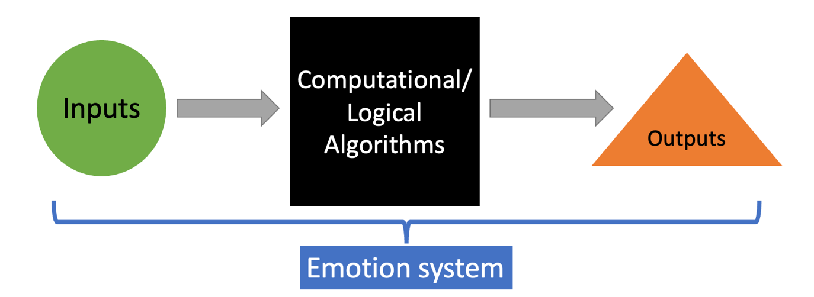
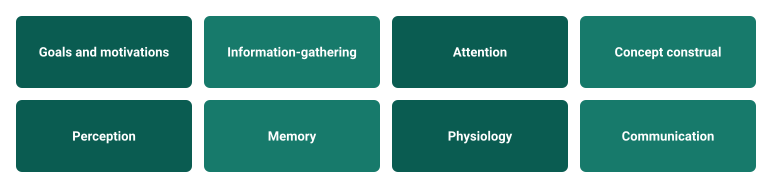

Personality traits as we commonly measure them in research are descriptive summaries of ways that people tend to differ from one another in their tendencies of thought, feeling, and behavior. But what generates these thoughts, feelings, and behavior? We can't just say that personality traits generate these differences because that would be circular reasoning, which is a [logical fallacy](https://www.logicallyfallacious.com/logicalfallacies/Circular-Reasoning). To explain personality, we ultimately need to tie these abstract trait constructs back to some more basic entities in the human mind. In this chapter, we'll look at a set of entities that are candidates for helping us better understand how personality variation may be generated: emotions.

What are emotions? You undoubtedly have some experience with emotions, and you may have your own views about how they work. In the field of psychology there are many theoretical views about what emotions are---how many there are; how they work; whether they have positive or negative "valence"; whether they feel good or bad or hot or cold. Much of this debate relies too much on the subjective experience and folk descriptions of emotions. For our purposes in this chapter, we'll take a particular computational view of emotions that is informed by evolutionary psychology, which provides a structured and non-arbitrary way of identifying and understanding emotions.

*Note: If phrases like "adaptations", "adaptive problems", "evolutionary fitness" are unfamiliar to you, you may want to review the chapter on "Evolution and Personality" before continuing.*

## An evolutionary framework for studying emotions

Emotions can be viewed as adaptations that coordinate a wide array of cognitive and physiological processes within organisms in response to specific adaptive problems (Cosmides & Tooby, 2000). Under this perspective, the features of many emotions are expected to have been designed through the iterative tinkering processes of natural selection and sexual selection, so that their features would *on average*[^1] produce behavior that helps to solve adaptive problems, and ultimately, increase evolutionary fitness. Different emotions are expected to have evolved in response to different adaptive challenges, each producing different adaptive responses. After all, what counts as fitness-enhancing behavior differs depending on the adaptive problem being faced --- hugging an approaching predator almost certainly isn't an adaptive response, but hugging an approaching loved one probably often is.

{#fig-emotion-system fig-alt="Flow diagram: Inputs feed into Computational/Logical Algorithms, which feed into Outputs; a brace beneath the whole sequence labels it the Emotion system." width="620"}

Using this view of emotions, we can think about emotions as having an input-output structure, like the one shown in @fig-emotion-system. What we call emotions are the patterns of activation that reliably occur in response to inputs that would have been reliably associated with the presence of adaptive problems in the ancestral past. Based on these inputs, emotions asses the severity of the adaptive problem and produce outputs---like thoughts feelings and behaviors---that would have reliably helped to solve the adaptive problem, on average, over evolutionary history. @tbl-adaptive-problems provides examples of different adaptive problems.

+------------------------------------+-----------------------------------+---------------------------------------------+
| Adaptive Problem                   | Cues                              | Solutions                                   |
+====================================+===================================+=============================================+
| Depleted nutritional state         | Low blood sugar, empty stomach    | Find food, eat                              |
+------------------------------------+-----------------------------------+---------------------------------------------+
| Predator threats                   | Fangs, large paw prints, growling | Escape, fight, heightened caution           |
+------------------------------------+-----------------------------------+---------------------------------------------+
| Devaluation by conspecifics        | Avoidance, harm, not sharing      | Attempt to regain value                     |
+------------------------------------+-----------------------------------+---------------------------------------------+
| Losing valued cooperation partners | Death of cooperator, mate left    | Attempt to regain partner, seek new partner |
+------------------------------------+-----------------------------------+---------------------------------------------+

: Examples of adaptive problems along with their potential cues and solutions {#tbl-adaptive-problems}

Let's explore the adaptive problem of predator threats in more detail. The inputs to an emotion that deals with predator threats should be activated by information from the external environment (inputs) that are reliable clues to the presence of predators. There are many potential clues that can range in their severity or information value for assessing whether there is a predator threat present. For example, seeing large paw prints or scat from a predator might raise the probability of a predator threat a little bit---but seeing the predator's fangs and hearing it growl is much a more informative cue and raises the probability of a predator threat a lot! So, the inputs that this predator threat emotion system allow it to assess the level or severity of the predator threat that is present.

In response to this assessment, the predator threat emotion system produces outputs in the form of coordinated responses that could help to mitigate the threat. In theory these responses should be proportional to the level of threat (input) detected because having too high a response could waste energy or lead to other negative outcomes, and having too low a response could lead to the threat not being averted---both of which are bad for fitness. For example, if scat or paw prints are all that is around and the emotion system assesses the threat levels as "medium", then a proportional response might be to freeze and listen or leave the area or have heightened caution going forward. But if fangs and growling are present and the emotion system assesses the threat level as "very high", then a proportional response might be trying to flee or call for help or fight.

We might call this predator threat emotion system "fear". But it's important to recognize that the names of emotions that exist in any given language may not necessarily correspond to evolutionary reality of emotions---words are just useful tools to describe concepts. What we call "fear" in language could refer to several different emotional systems within the brain, each designed to respond to a particular adaptive problem. Some of what we call fear, might be referring to the activity of a specific psychological mechanism (emotion) that is designed to respond to predator threats in particular. But other experiences that we call "fear" could be referring to the activity of emotion systems that are more narrowly dedicated to adaptive problems such as threats from venomous snakes, poisonous insects, physically dangerous conspecifics, and cliffs or other high-up places. We can make more detailed descriptions and boundaries between emotions that are less arbitrary than those that our language and folk psychology makes by starting with adaptive problems, their inputs, and their outputs.

We could follow similar logic for delineating the potential inputs and outputs for any adaptive problem to develop descriptions of other potential emotions. For example, if the adaptive problem is \[maintaining enough nutrients to power the body\], then an input could be \[low blood sugar\] and potential outputs would be \[stomach rumbling\], \[find food\], or \[eat food\]. We might call the subjective experience of the activity of this emotion "hunger" (Al-Shawaf et al., 2016).

### Emotions coordinate many processes

Emotions are expected to coordinate a wide array of processes in response to adaptive problems, including those that are beyond what we might typically think of as behavioral outputs. Some of these processes are listed in @fig-emotion-responses. For example, the activation of predator fear emotion system could change our current goals and motivations from finding food to escaping an area. Further, activation could shift our attention towards cues of predator presence and trigger information-gathering to further assess the threat level. Moreover, the concepts we apply to objects in the environment could change---what was just a rock before we detected a predator threat might now be conceptualized as a good weapon. Perception might change such that time feels slowed down or recall memory might be momentarily enhanced and it is easier to remember escape routes. Physiological changes, such as increased heart rate to pump oxygen to muscles in preparation for action, are also likely a component of many emotional responses. Many human emotions might also coordinate outputs that allow for communication of relevant information, via verbal communication or even non-verbal facial expressions; for example, fear might involve verbally communicating to others about the danger or making a face that communicates the information nonverbally.

{#fig-emotion-responses fig-alt="Eight boxes: goals and motivations, information-gathering, attention, concept construal, perception, memory, physiology, communication." width="700"}

Importantly, not all emotions should be expected to trigger all of these processes in all instances. The responses that are coordinated by a given emotion will depend on the particular set of responses that would have been necessary to solve the problem on average throughout the emotion's evolutionary history. For example, if nonverbal communication is not an important or detrimental for addressing a particular adaptive problem, then we should not expect there to be a clear facial expression associated with the emotion.

### Emotions have a species typical design

In general, this evolutionary framework of emotions expects that emotion systems function in basically the same way across all humans---that is, there is a species typical design of each emotion. This means that the ways emotions work should be relatively the same across all cultures. But of course, the words and descriptions that cultures develop to label, describe, and explain can differ substantially. This is because all humans who have ever lived share common ancestry in Africa around 70,000 years ago, which is very recent in evolutionary time. There likely hasn't been enough time for different emotions---which are complex adaptations requiring many pieces of our cognition and physiology to work together in concert---to evolve in the short time since humans have migrated to geographically and genetically isolated parts of the world, especially because there is still substantial gene flow between populations.

Researchers have applied this framework of emotions to study a wide array of emotions, including anger (Sell, 2011), shame and pride (Sznycer et al., 2016; 2017), jealousy (Buss & Haselton, 2005), fear (Öhman & Mineka, 2001), lassitude (the emotion of being sick; Schrock et al., 2020), gratitude (McCullough et al., 2008), guilt (Gilbert, 2003), disgust (Tybur et al., 2013), to name a few. I encourage you to at least skim one of the papers cited above for an emotion you're curious about to see how this approach works in practice. Next, we'll use this emotion framework to attempt to understand individual differences and personality.

## Individual differences in emotions

You might be confused about how emotions could have a universal or species-typical design and yet also be expected to be useful for explaining individual differences. But just like humans generally have the same species-typical body structure without looking exactly the same, emotions might have the same structure and still have minor differences. So, there is lots of room for individual differences in emotions! We'll explore below how individual differences in emotions and emotional outputs might arise and become relevant to personality.

### Many moving parts

Emotions depend on many interactions between many cognitive systems. For example, each emotion system may rely on "detecting algorithms" that monitor the situations for cues of adaptive problems and combine the cues to develop probabilistic estimates. There could well be subtle individual differences in the functioning or accuracy of these systems leading to small (or maybe even large) differences in assessments of adaptive problem levels. Other differences could be in the sub-systems that handle prioritizing goals, or the algorithms that calculate appropriate behavioral or physiological responses. Because differences in any of these subsystems within an emotion will play a role in determining behavior, small differences in any systems can lead to observable differences in behavior.

### Many sources of variation

As with any trait, differences in emotion systems can arise through genetics or environmental influences. Small genetic mutations can lead to random differences or "noise" in the functioning of emotion systems that may increase or decrease their effectiveness. Environmental insults like radiation or brain damage could have similar detrimental effects on emotion systems. Environmental influences across development could also lead to differences if emotion systems are calibrated (fine-tuned) by environmental information. For example, if the anger system gets feedback through development that anger is an effective bargaining tool, the anger system might be more easily triggered; or if the anger system gets feedback through development that anger is not an effective bargaining tool, then it may be less easily triggered. In sum, there are many ways that individual differences in emotion systems can arise, but this is not exactly the focus of the current module so let's move on.

### The social relevance of differences in emotions

Regardless of how the differences in emotion systems arise, the differences can be expected to result in differences in patterns of thoughts, feelings, and behavior (i.e., personality). Some people will experience emotions (e.g., anger, pride, shame, gratitude, guilt, fear) and their associated outputs (e.g., behavior, feelings) more easily or more often than others. These individual differences are useful for others and ourselves to recognize and label because this information may help us predict *future* behavior, which could allow us to make better decisions about social interactions. For example, if you know someone gets really angry really easily, you know to avoid doing anything to make them angry. Or if you know someone gets scared very easily, they may not be the best person to invite on a dangerous expedition.

Thus, the words that have emerged in the language may effectively capture socially relevant individual differences in emotions. Because words are the basic building blocks of the abstract personality descriptions that are popular in contemporary personality research[^2] (e.g., Big Five and HEXACO), personality trait constructs may ultimately capture socially relevant variation in emotion systems.

We should therefore expect that individual differences in emotion systems and individual differences in personality constructs should share a lot of overlap. Armed with this appreciation, we can start to develop predictions about how variation in emotion systems might relate to behavior, social judgments, and ultimately broad personality traits like those in the Big Five or HEXACO models.

## Reverse engineering personality constructs via emotions

If variation in emotions is roughly captured in person-descriptor words, and these person-descriptor words led to personality constructs (c.f., the lexical approach), we should be able to reverse engineer personality constructs (e.g., neuroticism, agreeableness) by linking them back to differences in emotion systems. Evolutionary psychologists (including me) have worked out a framework for tackling this endeavor (Lukaszewski, 2020; Lukaszewski et al., 2020). I'll summarize two strategies for reverse-engineering personality constructs here.

### Bottom-up: From emotions to personality constructs

The first strategy, which could be called "bottom-up", starts individual differences in emotions and then links them to established personality trait constructs. Here, the first step would be to identify an adaptive problem, develop hypotheses about the designs features of an emotion system that could solve that problem, and test those predictions to provide evidence for the hypothesized structure of the emotion. Either in these initial tests or in follow-up studies researchers can explicitly estimate individual differences in the emotion system, such as differences in the reactiveness of the emotional response, or severity of the emotional response. The researcher can make predictions about how these individual differences in the emotional responses and manifest behavior may relate to social judgements and person-descriptor terms. These predictions can then be tested to see if the measured differences in emotions predict personality traits.

### Top-Down: From personality constructs to emotions

The second strategy, which could be called "top-down", starts with established personality constructs and works backwards to link them to individual differences in emotions. Here, the first step would be choosing the focal personality trait(s) for study. Then, researchers can make predictions about what sorts of emotional reactions the personality trait(s) constructs may be capturing. Then the researchers can collect data on individual differences in emotions and personality traits to see if they are linked in the predicted ways. You should be able to practice this approach thinking about any trait you might be interested in---go ahead and give it a try!

### Empirical examples

Researchers have begun to apply this framework linking emotions to personality. Let's look at a few empirical examples here.

#### Anger and Agreeableness

The anger system is hypothesized to be designed to bargain for better treatment from people when they undervalue you (Sell, 2011). In line with this, anger is activated by information that suggests a person undervalues you (e.g., they harm you to get something they want). And the anger system produces outputs that effectively bargain for better treatment in the future, such as aggressive threats, demanding better treatment, or threatening to withdraw benefits in a relationship. In a sample of almost 400 people, self-reported individual differences in anger proneness correlate with self-reported individual differences in agreeableness at 0.79 (Lukaszewski et al., 2020). This suggests that over half of variation in the personality construct of agreeableness can be linked back to individual differences in the anger system.

#### Jealousy and Neuroticism

The jealousy system is hypothesized to be designed to prevent or mitigate threats to a valued relationship (e.g., romantic relationship or other cooperative relationship). Jealousy is activated by cues that a relationship may be threatened, such as your partner being interested in someone else or others being interested in your partner. The outputs of jealousy seem to be designed to effectively stop the relationship threats, for example by "guarding" your partner or increasing investment in a partner so that they are less likely to seek investment elsewhere. In a currently unpublished study, we examined jealousy in a sample of around 200 people in romantic relationships. We found that the severity of a person's jealousy reaction in response to imagining their partner engaging in behaviors with different levels of potential infidelity risk was correlated with their own self-perceptions of Neuroticism as well as others' perceptions.

## Emotions provide insight into lexical personality constructs

Although this research is still in its early stages, there is promising evidence that examining emotional variation will be useful for developing better descriptions and explanations of lexical personality constructs. My lab is currently exploring how individual differences in emotions like guilt, pride, shame, gratitude, and disgust relate to the personality constructs in the HEXACO framework. This will allow us to link the complex phenomenology of personality back to more basic constructs that we already have a relatively good understanding of at the *computational* and *algorithmic* levels of analysis. In the future, this may make it easier to develop better predictions about the *implementational* level of analysis for personality traits.

By adding up all the small differences in emotion systems, we may be able to account for large amounts of differences in broader personality constructs. This approach again shows that it is often necessary---or at least useful---to combine both ultimate and proximate perspectives to understand psychological phenomena. An understanding of the ultimate, evolved functions of emotions allows us to better examine how proximal differences in the functioning of emotions arise and how they relate to personality.

Of course, personality variation is probably not *only* emotion variation. There are likely many other psychological entities that generate differences in thoughts, feelings, and behavior. Other such entities in the mind might include things like inferences, preferences, values, signal detection thresholds, decision rules, and motivational systems. We'll explore some of these in future modules.

## References
Al-Shawaf, L. (2016). The evolutionary psychology of hunger. *Appetite*, *105*, 591-595.

Buss, D. M., & Haselton, M. (2005). The evolution of jealousy. *Trends in Cognitive Sciences*, *9*(11), 506-506.

Cosmides, L., & Tooby, J. (2000). Evolutionary psychology and the emotions. Handbook of emotions, 2(2), 91-115.

Gilbert, P. (2003). Evolution, social roles, and the differences in shame and guilt. *Social Research: An International Quarterly*, *70*(4), 1205-1230.

Lukaszewski, A. W. (2020). Evolutionary perspectives on the mechanistic underpinnings of personality. In J.** **Rauthmann (Ed.), *The handbook of personality dynamics and processe*s (pp. 523-550). San Diego, CA: Elsevier Press

Lukaszewski, A. W., Lewis, D. M., Durkee, P. K., Sell, A. N., Sznycer, D., & Buss, D. M. (2020). An adaptationist framework for personality science. *European Journal of Personality*, *34*(6), 1151-1174.

McCullough, M. E., Kimeldorf, M. B., & Cohen, A. D. (2008). An adaptation for altruism: The social causes, social effects, and social evolution of gratitude. *Current directions in psychological science*, *17*(4), 281-285.

Öhman, A., & Mineka, S. (2001). Fears, phobias, and preparedness: toward an evolved module of fear and fear learning. *Psychological review*, *108*(3), 483.

Sell, A. N. (2011). The recalibrational theory and violent anger. *Aggression and violent behavior*, *16*(5), 381-389.

Schrock, J. M., Snodgrass, J. J., & Sugiyama, L. S. (2020). Lassitude: The emotion of being sick. *Evolution and Human Behavior*, *41*(1), 44-57.

Sznycer, D., Al-Shawaf, L., Bereby-Meyer, Y., Curry, O. S., De Smet, D., Ermer, E., \... & Tooby, J. (2017). Cross-cultural regularities in the cognitive architecture of pride. *Proceedings of the National Academy of Sciences*, *114*(8), 1874-1879.s

Sznycer, D., Tooby, J., Cosmides, L., Porat, R., Shalvi, S., & Halperin, E. (2016). Shame closely tracks the threat of devaluation by others, even across cultures. *Proceedings of the National Academy of Sciences*, *113*(10), 2625-2630.

Tybur, J. M., Lieberman, D., Kurzban, R., & DeScioli, P. (2013). Disgust: evolved function and structure. *Psychological review*, *120*(1), 65.

[^1]:
This means that emotions should not be expected to produce the perfectly adaptive behavior in every situation or every person, even when they are functioning just as they are "supposed" to. Instead, the responses that are produced can be expected to be those that have worked most frequently across most situations throughout evolutionary history.
[^2]:
See the lexical studies discussed in the "Contemporary Personality Perspectives" lecture for a refresher.
