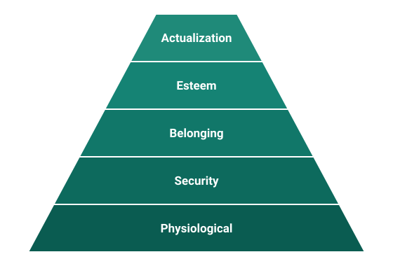
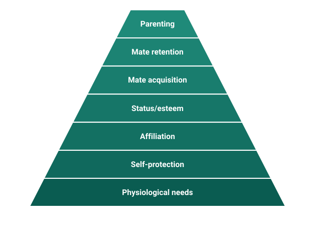

In the last module, we explored how variation in personality maps on to variation in emotions. We learned that ultimate perspectives about the evolved functions of emotions can inform proximal research questions about relationships between emotional variation and personality. In this chapter, we'll use another ultimate framework---that of evolved fundamental motives---to explore how differences in motivational priorities might help to explain abstract personality constructs captured by descriptive lexical dimensions like the Big Five and HEXACO traits.

*Note: If phrases like "adaptations", "adaptive problems", "evolutionary fitness" are unfamiliar to you, you may want to review the chapter on "Evolution and Personality" before continuing.*

## What are motivations?

When I ask students what a motivation is, I often get answers that involve "wanting", "desiring", "needing", or "striving" for a goal. This isn't wrong. It certainly fits with my own experience of what motivations feel like---and probably with your subjective experience as well. But we want to delve a little deeper to try to get beyond the subjective experience of motivation and the words we use to describe these experiences. We need a more *mechanistic* view of motivations: one that treats motivation as a component of the broader computational system that makes up the human mind.

For our purposes, motivations are internal states that activate and direct behavior towards goals or needs. Under this view, motivations aren't necessarily consciously represented. In fact, they probably aren't most of the time. Most of our motivations are totally outside of our awareness, implicitly guiding behavior towards goals and needs. We'll talk more about what these goals and needs might be later. But what are these internal states and how might we think about them?

)](images/10-pulley-system.jpeg){#fig-pulley fig-alt="Line drawing of a block-and-tackle pulley system: a weight suspended by a rope that passes over several pulley wheels mounted in a frame." width="320"}

Cognitive psychologists in the evolutionary psychology tradition developed the concept of **Internal Regulatory Variables**, which provide a more detailed way of thinking about what motivations are from a computational cognitive science perspective (Tooby et al., 2008). An internal regulatory variable (abbreviated as IRV) can be thought of as a numerical representation of value or meaning about states of the world. You might want to think about IRVs like parameters in a mathematical equation or computer code; or as rocks in some sort of old-timey physical pulley system like that shown in @fig-pulley. Depending on the magnitude of the parameters or the weight of the rocks, they lead to different consequences for the equation, computer program, or pulley system.

Internal regulatory variables could represent many types of information. Examples include: your own physical strength or attractiveness; the physical strength, attractiveness, or genetic relatedness of conspecifics; how much a person values or disvalues us; how long it has been since you heard a scary noise in the bushes; the fairness of resource distributions within a group; the nutritional value of an edible object; status impacts of different behaviors; and many more features of the world. If IRVs exist within the mind, they can be involved in regulating behaviors, thoughts, and feelings.

For example, imagine a situation where a person has just taken an apple from you. The decision of whether to take action to get apple back, and which actions to take, depend on many other details of the situation: who is the person to you---friend or foe? Do you need the apple for sustenance or is it superfluous? If the apple is needed, are you able to physically take the apple back from the person? How much do others value the person? Do you have kin nearby who would back you up in a conflict? How would losing such a conflict impact your status within the community? Each of these aspects of the situation (and many others) can be represented by IRVs in the mind that are involved in the computation of decisions to approach the person, bargain with the person, fight the person, etc. --- which we experience and lexically label with our everyday language as "desire" or "motivation".

Internal regulatory variables play a role in regulating behavior, thoughts, and feelings in concert with other entities in the mind, like emotions that we discussed in the previous chapter. The folk concept of motivation and the representations of it in our language may reflect individual differences in underlying internal regulatory variables. I doubt that all IRV's are reflected in what we call motivations---but it seems likely to me that all motivations are manifestations of IRVs. We experience (some of) the computations carried out by our minds subjectively as "wanting" or "needing" or "being motivated" to do things (e.g., do homework, brush our teeth, work out, go on a date, hang out with friends, write a free personality textbook).

The theoretical concept of motivation that we'll rely on is the different weights that our minds place on the value of different goals. But what are the goals that humans have? How can we determine which ones are important to study?

## What goals are motivations for?

There have been many attempts to identify the most basic or important human goals or motivations. A common theme in motivation theories is that peoples' behavior is largely determined by the goals they are pursuing and the motives that are active.

### Early motivation theorists

Freud and the neo-Freudians that we discussed back in the "Past Personality Perspectives" chapter each had their own hunches about which motives drive for human behavior. Freud thought that the libido, or the sex drive, was the primary motivational drives in humans. As for the neo-Freudians, Karen Horney argued that the primary human drives were the need for belonging and security, while Alfred Adler argued that people were primary motivated by the need for superiority (or at least avoiding inferiority). Who is right?

These theories of motivation appear to overlook the fact that there are likely to be many fundamental human motives. There probably isn't just one motive or drive that can be held responsible for all of the varied behaviors that people engage in. We probably need several motives to explain the many in thoughts, feelings, and behaviors that humans produce.

### Maslow's hierarchy of Needs

One of the first proposals of a list of multiple fundamental motives was developed by Abraham Maslow in 1943, which is referred to as Maslow's Hierarchy of Needs[^1]. @fig-maslow shows the typical representation of Maslow's hierarchy as a pyramid. According to Maslow, behavior will be geared towards addressing whichever goal is currently being worked on, and the lower-order needs at the bottom of the hierarchy must be fulfilled before the higher-order needs (higher on the pyramid) can be achieved.

{#fig-maslow fig-alt="Five-level pyramid. From the base upward: Physiological, Security, Belonging, Esteem, Actualization." width="470"}

Physiological needs are basic needs of survival, such as water, food, shelter, and rest. Moving up the pyramid, the next level is safety needs, which involve seeking protection from physical and emotional harm, as well as security and stability. Beyond this, the third level is composed of social needs, highlighting the importance of belonging, companionship, and meaningful relationships. Esteem needs at the fourth level, revolve around self-esteem, self-respect, and recognition from others. Finally, at the pinnacle of the hierarchy, we find self-actualization needs, representing things like aspiration for personal growth, spiritual enlightenment, self-fulfillment, and the realization of one's ideal self.

Maslow's hierarchy was primarily about understanding and explaining differences in fulfillment, happiness, and well-being. But we can apply it to personality as well. If a person's behaviors, thoughts, and feelings are dominated by the need to fulfill their current need, then their personality could be explained by looking at which needs the person is typically confronted with addressing. A person who is often simply trying to fulfill physiological needs can be expected to act different, on average, from a person who has met their physiological needs and is striving for higher needs, like self-actualization. For we example, we might expect a person who does not have their basic safety needs met, may act more worried or impatient---ultimately being perceived as more neurotic or less agreeable. A person who has all their basic needs met and is working on self-actualization needs might engage more with complex, abstract ideas or be more willing to donate their time---leading them to be perceived as open and agreeable.

Maslow's hierarchy is certainly a popular framework of motivation and it can be useful in understanding behavior and individual differences, in theory. But the needs in the Maslow's hierarchy are ultimately somewhat arbitrary. Maslow didn't arrive at the particular needs in his hierarchy through any broader theory and he didn't identify the particular needs in the hierarchy through systematic data collection. Ideally, we would want a theory-driven framework that explains why humans have the motives they do and that is supported by empirical data. Next, we'll explore just such a framework and see how it can help us understand personality variation.

### The Revised Fundamental Motives Framework

In the early 2000s evolutionary psychologists revised Maslow's Hierarchy based on evolutionary theory and considerations of fundamental adaptive problems (Kenrick et al., 2010). If complex motivations---sets of internal regulatory variables---evolve in humans, it can be expected that they helped solve some problem of survival and reproduction over the course of evolutionary history. Thus, the set of human goals and motivations should largely correspond to the set of adaptive problems that humans faced throughout our evolutionary history. Based on considerations of adaptive problems, Kenrick and his colleagues identified the fundamental motives depicted in @fig-motives.

{#fig-motives fig-alt="Seven-level pyramid. From the base upward: Physiological needs, Self-protection, Affiliation, Status/esteem, Mate acquisition, Mate retention, Parenting." width="500"}

Under this evolutionary fundamental motives framework, a given motive will be activated in response to the relevant cues of the adaptive problem being present. For example, if you enter into a competition that could affect your status, then internal regulatory variables related to status motives will be relevant; or if predators are detected, then internal regulatory variables related to self-protection will be involved. Of course, some goals, like kin care or mate acquisition and retention can only be activated at particular life-stages and depend on achieving some other goals---mate retention is only relevant if you already solved the adaptive problem of acquiring a mate, for example. Moreover, these motives are fairly rough categories that could be further divided up into more narrowly defined adaptive problems. But ultimately, this framework provides some useful dimensions that we can explore in relation to personality.

#### Linking fundamental motives to personality constructs

Neel and colleagues (2016) developed scales to measure individual differences in each of the fundamental motives, along with more specific aspects of them (e.g., disease avoidance within safety needs). Evidence suggests these scales have good reliability and their validity has largely been established by linking them to other individual difference constructs like personality traits. As shown in @tbl-motives-bigfive, several studies in sample from the USA (Ns \> 200) show that individual differences in fundamental motives are reliably linked to Big Five personality trait constructs in predictable ways (Neel et al., 2016).

| Fundamental motive | E | A | C | N | O |
|:---|:---:|:---:|:---:|:---:|:---:|
| Self-Protection | .04 | .03 | .09\* | **.17\*** | .06\* |
| Disease Avoidance | -.07\* | **-.10\*** | **.10\*** | **.10\*** | -.03 |
| Affiliation (Group) | **.41\*** | **.45\*** | **.21\*** | **-.22\*** | **.14\*** |
| Affiliation (Exclusion Concern) | **-.14\*** | **-.14\*** | **-.25\*** | **.43\*** | **-.08\*** |
| Status | **.26\*** | -.06\* | .03 | .06 | **.12\*** |
| Mate Seeking | -.01 | **-.16\*** | **-.13\*** | .05 | .03 |
| Mate Retention (General) | .03 | **.29\*** | **.29\*** | -.09\* | .12\* |
| Mate Retention (Breakup Concern) | **-.13\*** | **-.25\*** | **-.31\*** | **.37\*** | -.03 |
| Kin Care (Family) | **.21\*** | **.42\*** | **.29\*** | **-.15\*** | **.11\*** |
| Kin Care (Child) | .02 | .23\* | .19\* | .03 | .08 |

: Correlations between fundamental motives and Big Five personality traits from Neel et al. (2016) {#tbl-motives-bigfive}

#### Limitations of current motive measures

Of course, this research can't really show that motivations are *causing* the variation in personality. It could also be that differences in personality lead people to experience different situations that have more of particular adaptive problems. For example, extraverted individuals are more likely be in social situations, so they may be more likely to experience cues to adaptive problems relevant to status and affiliation. Or other individual differences like age may cause differences in both the fundamental motives and personality traits, leading them to be correlated even though they do not have a direct influence on one another.

Moreover, because both personality questionnaires and the fundamental motives questionnaires rely on self-reports in response to simple questions, it is possible that some of the correlations between personality and motivations are just reflective of having similar questions for each measurement tool. As an exercise in evaluating psychological measures, compare the example questions in @tbl-fm-items to questions in popular Big Five personality inventories---do you think there is a lot of overlap in the language of the questions that could drive the observed correlations in the data?

| Subscale | Sample item |
|:---|:---|
| Self-Protection | I think a lot about how to stay safe from dangerous people. |
| Disease Avoidance | I avoid people who might have a contagious illness. |
| Affiliation (Group) | I like being part of a team. |
| Affiliation (Exclusion Concern) | I would be extremely hurt if a friend excluded me. |
| Status Seeking | I want to be in a position of leadership. |
| Mate Seeking | I am interested in finding a new romantic/sexual partner. |
| Mate Retention | It is important to me that my partner is emotionally loyal to me. |
| Breakup Concern | I often think about whether my partner will leave me. |
| Kin Care (Family) | Caring for family members is important to me. |
| Kin Care (Children) | I like to spend time with my children. |

: Example questions from the fundamental motives questionnaire. {#tbl-fm-items}

In my own research (Durkee et al., 2023), I've also used self-report scales to measure HEXACO traits and status motivations in samples of participants in India and the USA (Ns \> 800). I found that higher status motivations were reliably connected to higher Extraversion and lower Honesty-Humility in both countries. In India, higher status motivations were also linked to higher Conscientiousness and higher Openness. These findings add some additional evidence that motivational priorities are reliably linked to personality traits. But they also suggest that some of these connections may differ depending on the cultural interpretations of motivations and their manifest behavior, thoughts, and feelings.

## Closing thoughts about motivations and personality

In this chapter, we've learned that the concept of motivations may refer largely to subtle differences in the weight that organisms---or more accurately, organisms' internal regulatory variables---place on different adaptive problems. We explored how differences in motivations could be expected to relate to descriptive personality constructs like the Big Five and HEXACO traits. Just like with emotions, many of the personality trait terms we employ describe subtle differences in peoples' motivational priorities, or the weights that their mind places on addressing different adaptive problems. This can again help us to better predict how others may behave in different situations.

Ultimately, we will need more direct measures of the state of internal regulatory variables to examine their roles in personality variation more accurately. But even at the current level of analysis that relies on self-reports, we can get a sense of how motivation and personality constructs are intertwined. This gives us a better understanding of both constructs.

The motivational frameworks we explored here are also just useful tools for understanding individual differences in thoughts, feelings, and behaviors---including our own! Next time you feel (un)motivated to do something (e.g., studying), you can think about what how the situation may relate to a fundamental adaptive problem and imagine different internal regulatory variables interacting in your mind to produce your experience. Maybe you can identify characteristics of the situation or yourself that you can make more salient or change in order to alter your motivations to produce behaviors, thoughts, and feelings, that you think are desirable. As we'll see in a later chapter on personality change, if you can repeatedly trigger and act on specific motivations over long periods of time, you may be able eventually change the average trajectories of your thoughts, feelings, and behavior.

## References

Durkee, P. K., Lukaszewski, A. W., & Buss, D. M. (2023). Status-impact assessment: Is accuracy linked with status motivations?. *Evolutionary Human Sciences*, *5*, e17.

Kenrick, D. T., Griskevicius, V., Neuberg, S. L., & Schaller, M. (2010). Renovating the pyramid of needs: Contemporary extensions built upon ancient foundations. *Perspectives on psychological science*, *5*(3), 292-314.

Maslow A.H. (1943). A theory of human motivation. *Psychological Review*, 50, 370--396.

Neel, R., Kenrick, D. T., White, A. E., & Neuberg, S. L. (2016). Individual differences in fundamental social motives. *Journal of personality and social psychology*, *110*(6), 887.

Tooby, J., Cosmides, L., Sell, A., Lieberman, D., & Sznycer, D. (2008). Internal regulatory variables and the design of human motivation: A computational and evolutionary approach. *Handbook of approach and avoidance motivation*, *15*, 251.

[^1]: Note that psychologists use "goals", "motivations", and "needs" pretty much interchangeably.
