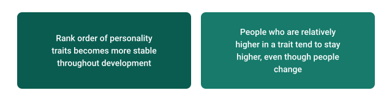

This chapter covers personality development from infancy to adulthood. We'll examine personality development in terms of the Big Five personality traits. Specifically, we'll explore how the structure of personality changes across development, how personality becomes more stable over time, and normative trends in how personality "matures" as we get older.

## Temperament versus Personality

Historically, developmental psychologists have distinguished between *temperament* and personality (Shiner et al., 2021). Temperament in this context refers to individual differences in the first two years of life. In theory, temperament is expected to have a stronger biological basis because these individual differences emerge soon after birth, ostensibly before culture and other aspects of the environment can have much influence.

Distinguishing between temperament and personality as different constructs might not be necessary, however. Shiner and colleagues noted in a recent review of personality development that "it has become increasingly clear that temperament versus personality is a distinction without much of a difference" (Shiner et al., 2021, p. 117).

For our purposes, we'll refer to all individual differences in tendencies of thought, feeling, and behavior as personality, regardless of what life stage we're examining. However, as we will see, this doesn't mean that personality looks exactly the same across the lifespan.

## The Little Six?

There are some important differences between youth and adult personality (Soto & Tackett, 2015). One of the biggest differences is in the *structure* of personality. We learned about the structure of adult personality back in the "Contemporary Personality Perspectives" chapter.

To review, personality structure refers to the patterns of overlap among personality traits. The Big Five personality structure, for example, was identified because the many trait terms that describe people can be roughly grouped into five large groups of broad personality traits. This five-factor structure is sufficient to summarize the individual differences between adults in many cultures. But does the structure of personality look the same in childhood and adolescence?

There are non-trivial differences in the structure of personality in childhood and adulthood. When measuring the Big Five in adults, the dimensions are mostly uncorrelated---meaning they do not overlap very much. In childhood, however, Conscientiousness and Openness exhibit substantial overlap, as do Conscientiousness and Agreeableness. Moreover, a study involving over 3,000 children and early adolescents from five countries found that only extraversion, agreeableness (primarily based on disagreeable behavior), and openness (primarily based on intellectual interests and ability) consistently emerged as broad dimensions of personality across different cultures and age groups (Tackett et al., 2012). This raises doubts about whether the Big Five personality traits adequately capture youth personality. An alternative structure, the *Little Six*, has been suggested as a potential candidate.

The "Little Six" is a model of youth personality that combines key traits from both child temperament and adult personality studies (Soto & John, 2014). Child temperament models have historically included four dimensions: sociability, negative emotionality, persistence, and activity level. Interestingly, three of these dimensions align well with adult personality traits, like extraversion, neuroticism, and conscientiousness. This suggests that there might be six fundamental personality dimensions: extraversion, agreeableness, conscientiousness, neuroticism, openness to experience, and *activity*. Recent research on parents' reports of their children's personalities supported this idea, showing that the Little Six structure is present consistently from middle childhood through adolescence, while the traditional Big Five structure emerges later in late adolescence. These findings also suggest that as we age, childhood variation in the activity dimension merges with Extraversion.

## General Principles of Personality Development

There are two broad principles that have been supported by empirical research on personality development. We will call the first the "cumulative continuity" principle. We will call the second the "maturity" principle. We will explore each in the relevant sections below, and also examine some interesting caveats.

**The cumulative continuity principle** refers to the *stability* of personality traits over time in terms of rank-order consistency in personality scores. This is typically examined using test-retest correlations of personality scores across varying periods of time (e.g., 2 weeks, months, or years). Research on the cumulative continuity principle has consistently shown that personality traits tend to become increasingly stable as individuals progress through adulthood (e.g., Bleidorn et al., 2022). This means that individuals tend to maintain their relative positions on various personality dimensions as they age. Put another way, if someone is more extraverted than their peers during early adulthood, they're likely to maintain that higher level of extraversion as they grow older. @fig-cumulative summarizes the cumulative continuity principle.

{#fig-cumulative fig-alt="Two points: rank order of personality traits becomes more stable throughout development; people who are relatively higher in a trait tend to stay higher, even though people change." width="620"}

Personality might stabilize with age for a variety of reasons. Physical features---height, for instance---tend to stabilize after puberty. If those features play a role in personality, then they can contribute to personality stability. Likewise, peoples' environments tend to stabilize as they get older. For example, people tend to settle into careers that expose them to similar situations that lead to more stability in behavior, thoughts, and feelings.

The idea of *person-environment transactions* provides a useful conceptual tool for thinking about how environments and personality interact to stabilize personality over time (Donnellan, 2023). Let's explore the three types of person-environment transactions and develop an example of each. You should be able to identify examples of these transactions in your own life as well.

> **Active person-environment transactions** capture the fact that people seek out experiences and environments that are consistent with their personality traits. For example, a person who enjoys taking risks will be more likely to seek out risky situations (e.g., casinos) than someone who is risk averse. Over time, this can lead to average differences in environments that contribute to the stability of personality.
>
> **Reactive person-environment transactions** capture the fact that different people react differently to the same environments because of their personality traits. For example, if you were to drag a group of friends to a loud karaoke bar for your birthday, you may see that some friends have a fun time and enjoy the event, whereas some friends may do all they can to avoid being the center of attention. This tendency for personality traits to be associated with different responses to the same environment also contributes to personality stability.
>
> **Evocative person-environment transactions** capture the fact that different people may trigger different responses from others in their social environments because of their traits. For example, a person who is very disagreeable or rude may be more likely to experience others being rude or disagreeable in return, whereas someone who is kind and polite may be more likely to elicit kindness and politeness from others. This can create feedback loops between personality and situations that reinforce the average patterns of thoughts, feelings, and behaviors that make up personality.

The stability of personality is far from perfect, though. Research on the stability of personality across the lifespan suggests that the stability of personality increases throughout childhood, our teen years, and early adulthood before plateauing in the early thirties and staying relatively level into older adulthood. Even when the estimates of personality stability are at their highest point, they suggest that about 50% of the variation in the rank-ordering of personality traits at one time can be explained by differences in the rank-ordering of personality in the past. That means that another 50% of the rank-ordering must be attributable to changes in personality (e.g., systematic changes or random changes). Thus, even though our personality stabilizes as we age and reaches a pretty high level of stability, that doesn't mean that changes do not occur.

**The maturity principle** focuses on mean-level development---the average levels of specific personality traits at different ages. According to research on personality development, most people across many countries tend to become more agreeable, conscientious, and emotionally stable (less neurotic) as they grow older (Bleidorn, 2015). @fig-maturation summarizes the key findings that inform the personality maturation principle.

{#fig-maturation fig-alt="Two points: there is consistency in the average changes in trait levels during development; most people become more conscientious, agreeable, and emotionally stable with age." width="620"}

There is one caveat to the maturity principle. Researchers have found that the biological, social, and psychological changes that occur during the transition from childhood to adolescence can lead to temporary dips in agreeableness, conscientiousness, and openness to experience (Soto & Tackett, 2015). For most, puberty is the period of life characterized by the most turbulent personality change. This idea of *personality disruption* will come as no surprise to any parents of teenagers reading this.

## Normative Trends Aren't "One Size Fits All"

We've examined the major normative trends in personality development: personality becomes more stable as we age, and people tend to become more agreeable, emotionally stable, and conscientious. However, these trends reflect the *average* tendencies of how a population of people can be expected to change. They don't necessarily predict how any given individual will change---it's very possible that your own personality development doesn't seem to fit these normative trends very well.

Perhaps the most significant finding of the last few decades of empirical research on personality change is that personality development is massively *heterogenous*, meaning that there are many individual differences in how personality changes. This heterogeneity is itself an interesting phenomenon that personality researchers are only beginning to study. Eventually, we may have a better sense of factors that predict differences in personality change. For now, it's enough to recognize that, even though the empirical research has revealed robust trends in how populations tend to change, normative trends aren't "one size fits all". Personality changes differently for different people.

## References
Bleidorn, W. (2015). What accounts for personality maturation in early adulthood?. *Current Directions in Psychological Science*, *24*(3), 245-252.

Bleidorn, W., Schwaba, T., Zheng, A., Hopwood, C. J., Sosa, S. S., Roberts, B. W., & Briley, D. A. (2022). Personality stability and change: A meta-analysis of longitudinal studies. *Psychological bulletin*, *148*(7-8), 588.

Donnellan, M. B. (2023). Personality stability and change. In R. Biswas-Diener & E. Diener (Eds), *Noba textbook series: Psychology.* Champaign, IL: DEF publishers. Retrieved from [http://noba.to/sjvtxbwd](http://noba.to/sjvtxbwd)

Shiner, R. L., Soto, C. J., & De Fruyt, F. (2021). Personality assessment of children and adolescents. *Annual Review of Developmental Psychology*, *3*, 113-137.

Soto, C. J., & John, O. P. (2014). Traits in transition: the structure of parent‐reported personality traits from early childhood to early adulthood. *Journal of Personality*, *82*(3), 182-199.

Soto, C. J., & Tackett, J. L. (2015). Personality traits in childhood and adolescence: Structure, development, and outcomes. *Current Directions in Psychological Science*, *24*(5), 358-362.

Tackett, J. L., Slobodskaya, H. R., Mar, R. A., Deal, J., Halverson Jr, C. F., Baker, S. R., \... & Besevegis, E. (2012). The hierarchical structure of childhood personality in five countries: Continuity from early childhood to early adolescence. *Journal of Personality*, *80*(4), 847-879.
