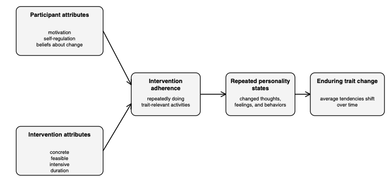

Back in the development chapter, we examined how personality changes across the lifespan. We learned that personality traits aren't perfectly fixed. People tend to become more stable in their relative standings as they get older, and there are average developmental trends in traits like agreeableness, conscientiousness, and emotional stability. But that still leaves a more personal question: can people change their personality in the specific ways they want to change?

This is a tricky question because the answer depends on what we mean by change. If we mean becoming a completely different person overnight, then the answer is almost certainly no. Personality traits are relatively stable summaries of typical patterns of thoughts, feelings, and behaviors, and they do not usually flip all at once. But if we mean shifting those average patterns over weeks, months, or years, then the answer appears to be yes. The harder questions are how this happens, how much change is possible, and what conditions make change more likely.

In this chapter, we'll examine *volitional personality change*, which refers to intentional efforts to change one's own personality traits. We'll also examine evidence from clinical interventions, because psychotherapy and other structured interventions may change personality even when that is not the explicit goal. Along the way, we'll keep returning to a basic idea: traits are broad descriptions, so changing a trait probably requires repeatedly changing the smaller state-level thoughts, feelings, and behaviors that make up the trait.

## Many People Want to Change Their Personality

Before asking whether people can change their traits, it helps to know that many people want to. If you ask people whether there's some aspect of their personality they'd like to change, most can think of something. This shouldn't be surprising, because personality traits are tied to many outcomes people care about (e.g., relationships, work, health, emotional well-being).

The most common desired changes also make intuitive sense. Across studies, people often report wanting to become more emotionally stable, more conscientious, more extraverted, and more agreeable (Baranski et al., 2021; Hudson & Fraley, 2015). Put another way, many people would like to feel less anxious, become more disciplined and organized, feel more socially confident, or be kinder and more patient with others. Notice that these desired changes overlap quite a bit with the maturity principle from the development chapter, which described the average tendency for people to become more agreeable, conscientious, and emotionally stable with age.

However, wanting to change is not the same thing as changing. Lots of people want to exercise more, sleep better, save money, or start studying earlier for exams. The wanting is real, but it does not automatically produce the behavior. Personality change has the same problem. Preferring a different trait profile is one thing; repeatedly thinking, feeling, and behaving in ways that are different enough, and consistent enough, to shift your average tendencies is another.

## From Personality States to Personality Traits

A useful way to think about personality change is to distinguish between personality states and personality traits. A personality state is a temporary pattern of thinking, feeling, or behaving in a particular moment. For example, a person might behave assertively during a group task, conscientiously while studying, or (dis)agreeably during a conflict. A personality trait is a broader summary of how often and how strongly a person tends to show those states across many situations and over time.

This distinction makes personality change seem less mysterious. To become more extraverted, a person does not need to magically acquire some extraversion substance in their brain. They would need to spend more of their life in extraverted states (e.g., initiating conversations, expressing enthusiasm, approaching social opportunities). To become more conscientious, they would need to spend more of their life in conscientious states (e.g., planning, following through, organizing tasks, resisting impulses that interfere with goals).

The basic premise of many personality change interventions is that lasting trait change can be produced by modifying state-level thoughts, feelings, and behaviors over extended periods of time (Hudson, 2021; Hudson et al., 2021). Of course, not every temporary state becomes a trait. Acting outgoing one time won't make someone an extravert, and studying carefully for one exam won't make someone highly conscientious. The idea is that repeated states, practiced over time, may gradually become easier, more automatic, and more incorporated into the person's identity.

{#fig-change-framework fig-alt="Participant attributes (motivation, self-regulation, beliefs about change) and intervention attributes (concrete, feasible, intensive, duration) feed into intervention adherence, which leads to repeated personality states, which leads to enduring trait change." width="700"}

@fig-change-framework summarizes one way to think about this process. Interventions do not reach directly into the mind and rewrite a personality trait. They change what people repeatedly do. The most immediate bottleneck is *intervention adherence*---whether the person actually follows through with the activities, challenges, or behavioral practices the intervention requires. If adherence is low, then the intervention has little opportunity to change the person's recurring states. If adherence is high, then those recurring states may eventually contribute to identity changes, biological changes, and trait change.

So, insight alone is probably not enough. Insight may help, and motivation may help, but the central mechanism in this framework is repeated change in thoughts, feelings, and behaviors. If the behavioral pattern never changes, then there is not much for the trait summary to summarize differently.

## Participant Attributes That May Affect Change

People differ in how likely they are to benefit from a personality change intervention. One obvious factor is motivation. A person who strongly wants to change may be more willing to practice new behaviors, tolerate discomfort, and keep going when progress is slow. Motivation may matter a lot here because many personality change goals require doing things that initially feel unnatural. A shy person trying to become more extraverted may need to start conversations that feel awkward, and a disorganized person trying to become more conscientious may need to build routines that feel tedious.

*Self-regulation* is another important factor. Self-regulation refers to the ability to monitor one's behavior, inhibit competing impulses, maintain attention to goals, and adjust when things are not working. It matters because personality change requires many small decisions across time rather than a single decision. A person might decide in the morning to be more patient, more organized, or more outgoing, but the relevant test happens later when they're tired, stressed, busy, or distracted.

A third factor involves beliefs about change. Some people hold a relatively *fixed mindset* about personality, meaning they believe personality is basically set and cannot change much. Others hold a *growth mindset*, meaning they believe personality is fluid and can change. It's easy to imagine that a growth mindset should make personality change more likely---if people believe change is possible, perhaps they'll try harder and persist longer.

The evidence is less supportive of this idea than you might expect, however. In studies of emerging adults, beliefs about whether personality can change did not consistently predict actual trait change (Hudson et al., 2021). Beliefs may still matter in some contexts, but simply believing personality can change does not appear to be enough. A person can believe change is possible and still fail to follow through. Likewise, a person can be skeptical about personality change and still change if their daily behavior is repeatedly altered by an intervention, social role, or environment.

Growth mindsets may be encouraging, but personality change probably depends more on what people repeatedly do than on whether they endorse a general belief that change is possible.

## Intervention Attributes That May Affect Change

The design of the intervention also matters. A vague goal like "be more conscientious" or "be less anxious" may express a real desire, but it does not give the person much guidance. What should they do at 9:00 AM tomorrow, or when a friend texts them, or when they sit down to study? Personality traits are broad summaries, but interventions need to operate at the level of concrete states and behaviors.

One important feature is *concreteness*. A concrete intervention translates a broad trait goal into specific, detailed actions. For example, instead of just trying to be more organized, a person might decide to write a prioritized task list before bed each night, set a reminder for one recurring obligation, or spend ten minutes clearing a work space before starting homework. These particular examples won't work for everyone, of course. The advantage of a concrete plan is that it specifies what the person is actually supposed to do.

A second feature is *feasibility*. A goal can be concrete but unrealistic. If someone who currently avoids nearly all social interaction sets the goal of attending three large social events every week, the plan may fail simply because it's too demanding. Feasible interventions are challenging enough to create change but realistic enough that the person can actually follow through. Failed plans can sap motivation and make the person less likely to keep trying.

A third feature is *intensiveness*. An intervention that happens once is unlikely to produce lasting change unless it triggers repeated practice afterward. Personality traits summarize average patterns, so the intervention needs enough repetition to move those averages. That's why many interventions involve repeated challenges, prompts, reminders, or exercises over weeks or months.

A fourth feature is *duration*---how long the intervention continues. Even an intensive intervention may not last long enough for new behaviors to become habitual or identity-relevant. Longer is not automatically better, though, because people may stop adhering if the intervention becomes exhausting or inconvenient. But in general, changing a trait-like pattern should require sustained practice over time rather than a single burst of effort.

## Evidence from Psychotherapy and Clinical Intervention

One source of evidence for personality change comes from psychotherapy and clinical interventions. These interventions are usually designed to reduce distress, treat symptoms, or improve functioning rather than to change personality traits. Even so, they may alter the recurring thoughts, feelings, and behaviors that personality questionnaires measure.

A meta-analysis of intervention studies found that personality traits can change during psychological and clinical interventions, with especially notable changes in emotional stability (Roberts et al., 2017). Emotional stability is closely related to neuroticism (i.e., the tendency to experience frequent or intense negative emotions). So, if therapy reduces patterns of anxiety, worry, emotional reactivity, avoidance, or depressive thinking, it is not surprising that people may also look more emotionally stable on personality measures.

Psychotherapy is a good reminder that personality is not sealed off from the rest of psychology. The same processes that change symptoms, coping strategies, relationship patterns, or daily routines may also change trait-relevant patterns. We should still be cautious, though. When a person's depression or anxiety improves, their responses to personality items may change partly because they are in a different emotional state, and distinguishing true trait change from symptom change, response bias, or temporary state change is difficult. The evidence suggests that intervention-related trait change is possible, but that does not mean every therapy client changes personality in the same way or to the same degree.

## Evidence from Volitional Personality Change Studies

Research on volitional personality change asks a slightly different question: when people intentionally try to change their traits, do they move in the direction they want to move? Early studies suggest that they often do, at least to some degree. For example, people who reported wanting to increase a trait like extraversion tended to show increases in that trait over time (Hudson & Fraley, 2015). That's encouraging, but it leaves open the question of what people are actually doing that produces the change.

One answer comes from research on behavioral change challenges. In these studies, participants selected weekly challenges designed to pull their thoughts, feelings, and behaviors in line with their desired traits. A challenge aimed at extraversion might involve initiating a conversation, for instance, while a challenge aimed at conscientiousness might involve completing a task before a deadline. The key finding was that accepting the challenges was not enough. *Completing* them is what predicted trait change over time (Hudson et al., 2019).

This fits the state-to-trait logic described earlier. A challenge only matters if it changes what the person actually does. Accepting a challenge is a declaration of intent; completing one is a new behavior. Across enough repetitions, those new behaviors may accumulate into a different average pattern.

The evidence is not uniformly simple. Some interventions work better for some traits than others, and some attempts produce weak or unexpected results. Openness, for example, has sometimes been more difficult to change in a straightforward way than extraversion, conscientiousness, agreeableness, or emotional stability. This should not be surprising, because a personality trait is a broad, heterogeneous construct rather than a single behavior. Some parts of a trait may be easier to practice than others, and some interventions may target only a narrow slice of the broader trait.

More recent intervention studies have used digital tools to support personality change. In one randomized controlled trial, adults used a smartphone-based coaching intervention designed to support desired trait changes over several months (Stieger et al., 2021). Participants receiving the intervention showed greater changes than a waitlist control group, and some of those changes were also visible to people who knew the participants. This is stronger evidence than simple correlational studies provide, because random assignment helps rule out some alternative explanations. But even randomized interventions do not answer every question. We still need to know how long the changes last, which components are doing the work, and whether the changes produce improvements in life outcomes.

## How Much Change Is Possible?

The evidence reviewed in this chapter supports the possibility of personality change, but not unlimited change. Traits are relatively stable for a reason. They're shaped by many interacting factors (e.g., genetics, biological systems, developmental history, habits, relationships, social roles, environments). A short intervention can push on some of these factors, but it can't instantly replace all of them.

There are also limits in measurement. Many personality change studies rely on self-reports, and if people know they are trying to become more extraverted or more conscientious, they may later interpret themselves through that goal. Self-reports are not useless, but we should be skeptical of overly dramatic conclusions. Informant reports, behavioral measures, long follow-up periods, and randomized designs all help, though no single study design solves every problem.

Another issue is durability. A person might show meaningful change during an intervention but drift back toward previous patterns once it ends. This is common in behavior change more generally. A structured environment can make new behaviors easier, but when the structure disappears, old habits and old situations can return. Durable personality change likely requires continued adherence, new habits that persist without much effort, or environments that keep reinforcing the new pattern.

Finally, personality change is not automatically improvement. Higher levels of a socially desirable trait can still have costs in some contexts. More conscientiousness may come with rigidity or stress, more agreeableness may make it harder to set boundaries, and more extraversion may be useful in some environments and exhausting in others. Personality change should be evaluated against a person's goals, contexts, tradeoffs, and well-being rather than treated as a march toward the highest possible score on every desirable trait.

## So, Can People Change?

The answer isn't "personality is fixed," and it isn't "you can become anyone you want if you just decide hard enough." Both claims are too simple. Personality traits are stable enough that change usually requires sustained effort, repeated practice, and supportive contexts. But they're also malleable enough that interventions, therapy, social roles, and deliberate behavioral practice can shift them.

The state-to-trait perspective gives us a practical way to think about this. If traits describe average patterns of thoughts, feelings, and behaviors, then changing a trait requires changing those patterns repeatedly over time. A desire to change may start the process, and a growth mindset may make it feel more possible, but the step that seems to matter most is follow-through---repeatedly enacting the states consistent with the desired trait until they become typical.

This should also make us skeptical of magical thinking about personality change. A new label, a motivational quote, or a one-time insight is unlikely to transform a broad trait. Personality change is more mundane than that. It's built from repeated behaviors, recurring situations, feedback from others, and gradual shifts in identity and habit. That makes it sound less dramatic, but it also makes it something we can actually study.

## References
Baranski, E., Gardiner, G., Lee, D., & Funder, D. C. (2021). Who in the world is trying to change their personality traits? Volitional personality change among college students in six continents. *Journal of Personality and Social Psychology*, *121*(5), 1140.

Hudson, N. W. (2021). Dynamics and processes in personality change interventions. In *The handbook of personality dynamics and processes* (pp. 1273-1295). Academic Press.

Hudson, N. W., Briley, D. A., Chopik, W. J., & Derringer, J. (2019). You have to follow through: Attaining behavioral change goals predicts volitional personality change. *Journal of personality and social psychology*, *117*(4), 839.

Hudson, N. W., & Fraley, R. C. (2015). Volitional personality trait change: Can people choose to change their personality traits?. *Journal of personality and social psychology*, *109*(3), 490.

Hudson, N. W., Fraley, R. C., Briley, D. A., & Chopik, W. J. (2021). Your personality does not care whether you believe it can change: Beliefs about whether personality can change do not predict trait change among emerging adults. *European Journal of Personality*, *35*(3), 340-357.

Roberts, B. W., Hill, P. L., & Davis, J. P. (2017). How to change conscientiousness: The sociogenomic trait intervention model. *Personality Disorders: Theory, Research, and Treatment*, *8*(3), 199.

Roberts, B. W., & Jackson, J. J. (2008). Sociogenomic personality psychology. *Journal of personality*, *76*(6), 1523-1544.

Roberts, B. W., Luo, J., Briley, D. A., Chow, P. I., Su, R., & Hill, P. L. (2017). A systematic review of personality trait change through intervention. *Psychological bulletin*, *143*(2), 117.

Stieger, M., Flückiger, C., Rüegger, D., Kowatsch, T., Roberts, B. W., & Allemand, M. (2021). Changing personality traits with the help of a digital personality change intervention. *Proceedings of the National Academy of Sciences*, *118*(8), e2017548118.

Tang, T. Z., DeRubeis, R. J., Hollon, S. D., Amsterdam, J., Shelton, R., & Schalet, B. (2009). Personality change during depression treatment: a placebo-controlled trial. *Archives of general psychiatry*, *66*(12), 1322-1330.
